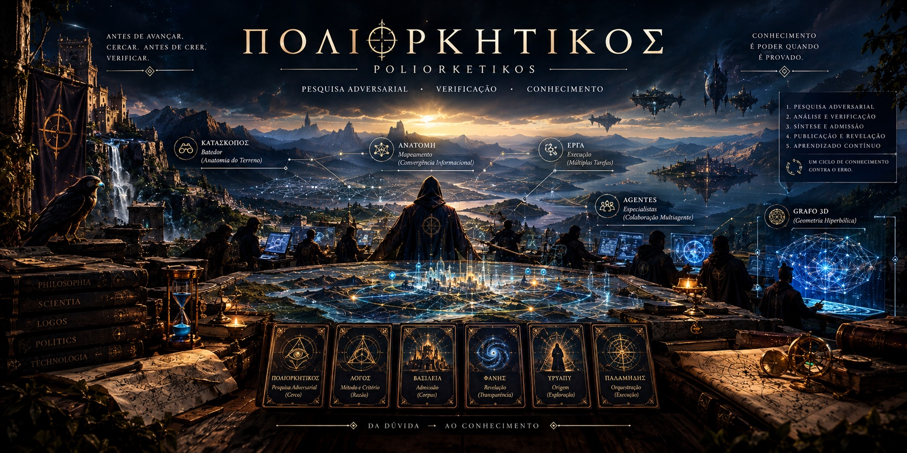
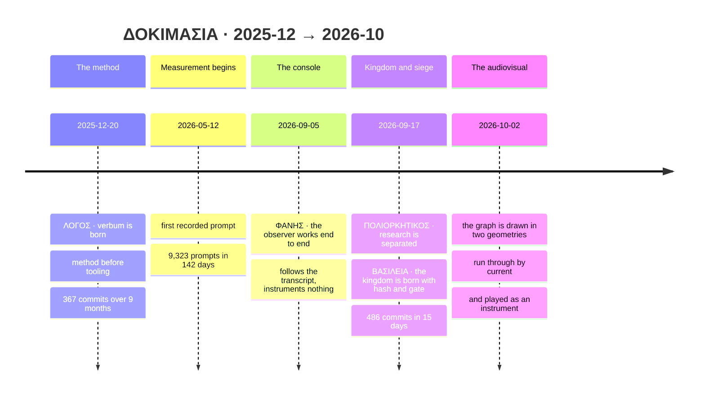
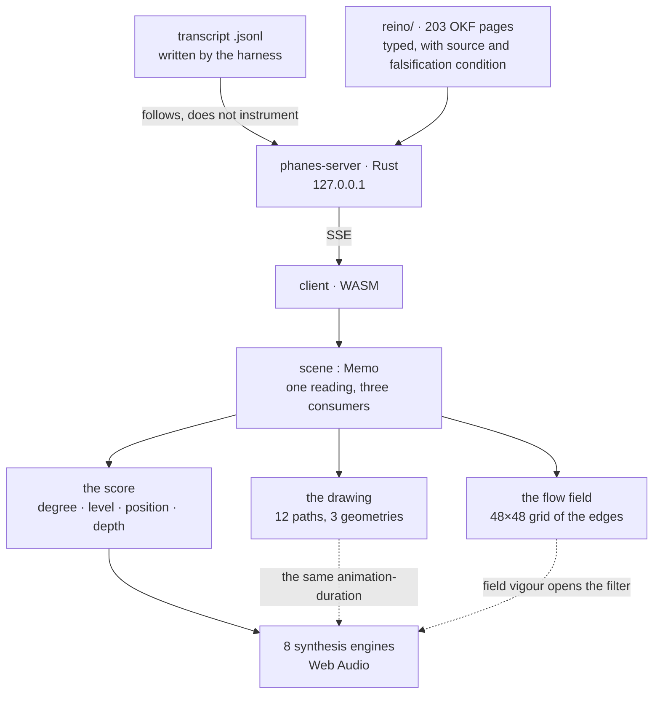

<div align="center">

[Português](README.md) · **🌐 English** · [Español](README.es.md) · [中文](README.zh.md)

</div>

<div align="center">


# ΔΟΚΙΜΑΣΙΑ · dokimasía

**The scrutiny, and what it reveals.**

**ΠΟΛΙΟΡΚΗΤΙΚΟΣ** · **ΛΟΓΟΣ** · **ΒΑΣΙΛΕΙΑ** · **ΦΑΝΗΣ**

[](https://www.youtube.com/watch?v=8xiHYIYnqsM)


▶ **[Watch the video](https://www.youtube.com/watch?v=8xiHYIYnqsM)**
📖 **[The wiki — the whole architecture, page by page](https://github.com/poliorketike/dokimasia/wiki)**

</div>

---

## The name

**δοκιμασία** was the examination Athens put a citizen through **before** letting him hold public
office. It was not a formality, and it was not private.

In Aristotle's account (*Constitution of the Athenians* 55), the candidate for archon was asked:
who is your father, and from which deme; who is your father's father; who is your mother, and from
which deme her father; whether you have the cult of Apollo Patroos and Zeus Herkeios — **and where
those sanctuaries are**; whether you have family tombs; whether you treat your parents well; whether
you pay your taxes; whether you did your military service. Then, **in public and before the Boule,
it was asked whether anyone wished to accuse him** — and only then was there a show of hands.

That is, trait for trait, what a page in this corpus must declare to get in:

| the Athenian question | the page's field |
|---|---|
| "who is your father, from which deme?" | **provenance** — the source, with verifiable origin |
| "where are the sanctuaries?" | **addressability** — the citation must resolve, not merely be claimed |
| "does anyone wish to accuse?" | **adversarial review** — and from another model family |
| the vote, in public | **admission with two witnesses**, one of them human |

And that is why one word names all four layers: **they are the four moments of a single dokimasía.**
Besieging is the examination (`ΠΟΛΙΟΡΚΗΤΙΚΟΣ`), the method is the questions (`ΛΟΓΟΣ`), admitting is
the vote (`ΒΑΣΙΛΕΙΑ`), and **the scrutiny being public is what makes it a scrutiny** (`ΦΑΝΗΣ`).

> A secret scrutiny is not a scrutiny: it is a decision with a convenient witness.

<sub>Sources: Aristotle, *Athenaion Politeia* 55 ·
[Todd, *The Athenian Procedure(s) of Dokimasia*](https://www.austriaca.at/0xc1aa5576%200x002544b1.pdf) ·
[Adeleye, *The Purpose of the Dokimasia*, GRBS](https://grbs.library.duke.edu/index.php/grbs/article/download/5741/5243)</sub>

---

> **This repository is a showcase, not the source.** It shows what can be seen, says what is behind
> it, and keeps the references. The experiment **will be open-sourced soon**; for now it is still
> running, and opening a lab mid-measurement ruins the measurement.

---

## What this is

A multi-agent system accumulates knowledge and **has nowhere to see it**. Tokens are spent, agents
run, sources are read, decisions are made — and none of it is visible.

**Phanes** is the console that reveals it: the memory graph, the real cost per turn, the provenance
of every claim, and the gates the work had to pass. In the Orphic tradition, Phanes is the deity of
**manifestation** and of **ordered origin** — the name describes the function: it does not create,
it reveals, and it reveals *ordered*.

### The thesis, stated as a thesis

> # Knowledge that cannot fall is not knowledge: it is decoration.

A claim that **no possible observation would contradict** is not informing you about the world — it
is informing you about whoever wrote it. In a multi-agent system this stops being philosophy and
becomes engineering: **the model produces fluent text as easily as it produces true text, and
fluency does not distinguish the two.**

So every page declares, in a mandatory `refutes` field, **what would bring it down**. Not
"limitations" — that is rhetoric. An **observable condition** that, if it occurs, forces revision.

### The three laws

| | law | what it forbids |
|---|---|---|
| 1 | **What protects is the gate** | a structure that describes the rule and rejects nothing |
| 2 | **Nobody approves what they produced** | self-consent — including by whoever wrote the gate |
| 5 | **A rule without a falsification condition is `assert True`** | the rule that always passes |

### The five epistemic classes

`OBSERVED` · `INFERRED` · `AUTHOR-DECLARED` · `NOT-DETERMINABLE` · `REFUTED`

**The fourth matters most.** A system that does not have `NOT-DETERMINABLE` ends up **inventing**
one of the other four — the pressure to answer is structural, and the shape of an answer does not
distinguish *"I measured"* from *"I suppose"*.

### The political part

A knowledge system is a system of **power over what counts as true**. Therefore: nobody approves
what they produced; every promotion needs **two witnesses, one of them human**; the adversarial
reviewer must come from **another model family**, because a panel of clones agrees with itself and
calls it consensus; **reputation is derived from recorded events**, never self-assigned — a member
born with a badge is born with a fraud; and the creator **is not described by himself** — the tribe
describes him and he strikes out what he rejects.

It is deliberately slow. **The cost of admitting wrongly is higher than the cost of admitting
slowly.**

---

## The pyramid

<div align="center">


&nbsp;

&nbsp;&nbsp;

</div>

**Six cards, in 1 · 2 · 3** — and the arrangement is not aesthetic, it is the architecture:

| row | who | what it does |
|---|---|---|
| **1 · the apex** | **ΥΡΥΑΠΥ** — *the sound of water* | **opens the question.** Nothing starts without someone wanting to know. It is where the beam comes from |
| **2 · the instruments** | **ΠΑΛΑΜΗΔΗΣ** — *the gnomon* · **ΛΟΓΟΣ** — *verbum* | **what measures, and by which method.** Neither is an act: both are the condition of every act |
| **3 · the acts** | **ΠΟΛΙΟΡΚΗΤΙΚΟΣ** · **ΒΑΣΙΛΕΙΑ** · **ΦΑΝΗΣ** | **besiege · admit · reveal.** The only ones that change the state of the world |

1+2+3 = 6 is not a counting coincidence: it is the third triangular number, the same figure the
Pythagoreans used to say that a whole is built in levels. Here it falls out on its own, because
there are exactly six.

> The apex asks · the waist measures · the base acts.

The pyramid has an axis that is not drawn in it: **φιλομαθής → φιλοπράκτωρ**, top to bottom.

### The cards, one line each

| | card | epithet | what it carries |
|---|---|---|---|
| 〰️ | **ΥΡΥΑΠΥ** | ἀρχιτέκτων · κυβερνήτης | "the sound of water" in Tupi-Guarani. The architect, and the system's only human gate: nobody promotes without him |
| 📐 | **ΠΑΛΑΜΗΔΗΣ** | γνώμων · ἔλεγχος | the gnomon — it does not shine, it **casts a shadow, and the shadow is the measurement**. Executes; never approves its own work |
| 🔷 | **ΛΟΓΟΣ** · *verbum* | — | method before tooling. Reason *and* ratio: λόγος is both, which is why it governs rather than follows |
| 🏰 | **ΠΟΛΙΟΡΚΗΤΙΚΟΣ** | — | the siege. `πόλις + ἕρκος`: to fence a city in. The art of the **enclosure**, contested from both sides |
| 🛡️ | **ΒΑΣΙΛΕΙΑ** · *regnum* | — | what has been admitted. Not "power": **the domain of what passed the examination** |
| ⭕ | **ΦΑΝΗΣ** | — | what reveals. In Orphic theogony Phanes is also named Protogonos, Erikepaios and **Metis** — *the revealer* and *thought* are the same figure |


#### Why *siege*, and not merely *control* — κυβερνητικός · πολιορκητικός



Both words end in **-ικός**, the *art of*, and both name the same difficulty: **acting on a system you do not command**.

**κυβερνητικός** comes from **κυβερνήτης**, the helmsman — the one who steers without ordering. The sea does not obey, and the ship arrives anyway: each turn of the loop, he **measures the drift and corrects**. That is the word Ampère took in 1834 for *cybernétique*, the science of government, and that Wiener took back in 1948 — partly in homage to Maxwell's *On Governors* (1868), noting that **governor** is the same word corrupted through Latin (`gubernare`). Hence a closure that is not wordplay: the **governance** screen of ΦΑΝΗΣ and the word **cybernetics** share one root.

**πολιορκητικός** adds what the helm lacks. The sea is indifferent: it pushes the ship, it does not study it. The city **answers back** — behind the wall someone watches the siege, learns from the attempt that failed, and changes the defence. That is not noise, it is an **adversary**, and it requires the model of the other side to sit *inside* the loop. Which is why the research layer is an adversarial system of 64 pairs, not a controller.

And this is where **Law 2** stops being a moral and becomes engineering: negative feedback requires the **sensor not to be the actuator**. A thermostat that asked the heater for the temperature regulates nothing. *"No one approves what they produced"* is that constraint, stated for agents.

→ **[the full page, with sources and what it does not claim](https://github.com/poliorketike/dokimasia/wiki/O-kybernetikos-e-o-poliorketikos)**

---

## In motion, with sound

<div align="center">


**[▶ video with audio (39 s, MP4)](av/grafo.mp4)** · **[🎧 sonification only (MP3)](av/grafo.mp3)**

</div>

In the video, **seven nodes are opened one by one** and each record is scrolled through: the page
type, its path in the kingdom, the rule, the why, the sources with addresses, the entities and what
it links to. That is what the graph exists to give — **the drawing is the index, the record is the
content.**

> The MP4's soundtrack **is not a soundtrack**: it is the graph played. Rendered outside the browser
> with the **same mapping** the console uses live — degree → pitch (the hub is the tonic and the
> bass), BFS level → octave and beat, position → stereo, Dorian scale over D2 (73.42 Hz), a 2.6 s
> bar split into five phases. Only the renderer changes.

### The one-minute set

<div align="center">


**[▶ full set, 60 s with audio](av/set.mp4)** · **[🎧 audio only](av/set.mp3)**
</div>

Sixty seconds playing the graph like a console: **timbres coming in and out**, the **tonic walking
the degrees of the Dorian scale** (D2 → F2 → A2 → G2 → D2), the **period** from 2.6 s to 1.4 s and
back to 4.0 s, the **register** going from unison to fifths to octaves — with **brown noise**
(12–24 s) and the **medieval sequencer** (30–42 s) coming in on top.

> **The tonic is not random.** It walks the degrees of the scale, so the changes land *inside* it
> instead of cutting it. "Randomising" without a scale gives change, not modulation.

**The score is a single one, read by both sides**: the browser executes the events while the video
records, and the offline renderer reads **the same** events to produce the audio — *one reading, two
consumers*. If there were two lists they would diverge, and the sync would be luck.

### hitech-set — the graph at 189 BPM

<div align="center">


**[▶ 80 s with audio](av/hitech-set.mp4)** · **[🎧 audio only](av/hitech-set.mp3)**
</div>

Hi-tech psytrance built from the graph, with **three numbers organising everything** — each entering
by the property it actually has, not the one that sounds good.

#### 142857 — now it fits

When the flow field needed to spread phases, **142857 did not help**: its property is not
distribution. Here the question is different, and it is exactly its own.

142857 is the repetend of 1/7, and its multiples 1 through 6 are **rotations of the same digits**:

```
1 × 142857 = 142857          4 × = 571428
2 ×        = 285714          5 × = 714285
3 ×        = 428571          6 × = 857142
7 ×        = 999999   ← the cycle breaks, and every digit saturates at once
```

That becomes the rhythmic structure: **six bars, each with a rotation of the accent mask**, and the
**seventh is the drop** — because 7 × 142857 = 999999 and all cells saturate together. The drop was
not placed there by taste: it **is** the seventh row of the table.

#### 189 BPM

**7 × 27**, where 27 = 1+4+2+8+5+7, the digit sum. It lands inside the hi-tech range (170–200)
without having been chosen by ear. Measured back from the signal by envelope autocorrelation:
**189.0 BPM**.

#### 6 against 16

The mask has 6 cells; the bar has 16 sixteenths. They only realign every **48 steps** (3 bars), and
with the 7-bar cycle on top, full alignment takes **336 steps — 21 bars**. The polyrhythm was not
programmed: it is what the two numbers produce on their own.

#### The colour, and the tuning

Raga **Bhairav** — S r G m P d N, semitones 0,1,4,5,7,8,11 — over a **Sa and Pa** drone. The tanpura
plays the classical order (Pa Sa Sa Sa) with the partials that make the *jivari*. The ratios are
small integers — **3/2, 9/8** — the monochord divisions. The Indian colour comes from there, not
from a sample.

#### And the graph, which is the input

**degree → scale degree** (the hub is Sa: the most-linked page is the tonic) · **BFS level →
octave**, and which voice plays at each step · **node index → pan** · **flow-field vigour → bass
filter opening**.

The score is in [`av/hitech-partitura.py`](av/hitech-partitura.py) — **a single one, read by both
sides**, like the others.

### The three models

The same graph, in three geometries. **[▶ all three in sequence (35 s)](av/modelos.mp4)**

| | what it is |
|---|---|
| `◻ euclidean` | the perspective projection: distance on screen is distance in space |
| `◎ projected disk` | the same 3D cloud taken to the disk — **there is still a camera and depth** |
| `⊚ hyperbolic disk` | **radial tree computed in the hyperbolic plane** — no camera, no depth |

<div align="center">


</div>

#### The projected disk

Edges are **geodesics** — arcs orthogonal to the horizon. The current runs inside them, so it curves
along. You can see the **curvature κ** taken from 0.8 to 3.2: the core opens, the periphery presses
against the horizon, and no point ever reaches it.

But it is still **a three-dimensional cloud seen from an angle**. Beautiful and correct — and not
the drawing in which the model's property appears.

#### The hyperbolic disk, native

It is the *hyperbolic browser* technique (Lamping, Rao & Pirolli, CHI 1995): **root at the centre,
each level on a ring**, and each node given an angular wedge proportional to **the size of its
subtree** — not to its number of children. Otherwise a branch with one child and a hundred
grandchildren would get a leaf's wedge, and the drawing would lie about where the corpus's mass is.

**Without a camera there is no depth.** What takes its place is distance from the centre, which is
what the model actually measures. And dragging stops moving the camera: it **turns the disk**, which
is the right gesture.

Separate components split the turn proportionally to size and start on the first ring, not at the
centre — **the centre is one place**, and giving it to a component would say it is the root of
everything.

> **A correction the measurement forced.** With depth in raw hops, `tanh(κ·d/2)` saturates: the
> median ρ was **0.976** and the whole graph sat against the horizon — the opposite of what the
> model exists to do. Normalised by the deepest ring it becomes the same computation as the projected disk
> and curvature matters again. Measured now: p10 **0.217** · median **0.414** · p90 **0.706** ·
> max **0.800**, with 203 of 203 inside.

The pulses continue: water, waterfalls, flow field and sound **read the same scene** in all three
models.

---

## After the siege: the operational layer

The siege does not end in a report. It ends in **works** — and the link between the two is what this
house calls **informational convergence**.

### The problem

A complex module has 30 tasks. Each requires **understanding the anatomy** before operating: where
things are, what depends on what, which invariant cannot be broken. Say two hours for that. Thirty
agents fanned out: **sixty hours of comprehension alone**, for thirty minutes of execution.

**Knowledge, unlike work, does not divide into parts.** Parallelising execution makes sense;
parallelising comprehension is paying N times for a good that is not rival.

| strategy | cost |
|---|---|
| **naive fan-out** | `N·(C + E)` |
| **convergence** | `C + A + N·(E + ε)` |

Convergence pays when **(N − 1)·C > A + N·ε**. With C in hours and ε in minutes, the break-even
lands at **N ≈ 2**: from two tasks over the same ground onwards, re-reading the ground is already
waste.

### The cost of entry, measured

The number that makes this concrete is not the anatomy's — it is the **mere act of entering**:

| | |
|---|---|
| sessions with usage accounting | **2,333** |
| context on the **first turn**, before any useful work | median **28,671** tokens · p90 **68,565** |
| summed across all sessions | **84.0 M tokens** |
| fraction of that first turn read from cache | **34%** |

**84 million tokens just to begin** — and that is the floor, not the anatomy. Cache solves repetition
*within* a session; **between** sessions, almost everything is paid again.

### The doctrine, in the vocabulary of the siege

| | | |
|---|---|---|
| **ΚΑΤΑΣΚΟΠΟΣ** | *kataskopos* | the scout sent ahead. **One**, not thirty. What he brings is not opinion: it is addressable description |
| **ΑΝΑΤΟΜΗ** | *anatomḗ* | "cutting through". The converged artefact: dependencies, invariants, where to cut. **Not a summary** — a summary is what is lost; the anatomy is what lets you operate without re-reading |
| **ΕΡΓΑ** | *érga* | the works. In a siege, those raised against the wall; here, the tasks claimed and executed |

And Poliorketikos **is already the planning of the operational layer**: when the siege is well drawn,
the task reaches the operator with the breaking point already identified. Research is not a separate
stage of the work — **it is what makes the work short.**

### The risk, which is the hard part

> **Convergence trades cost for correlated failure.**

The naive fan-out has an accidental virtue: thirty independent readers **disagree**, and that
divergence is an error-correcting code nobody designed. One reader and thirty executors do not have
it — **if the anatomy is wrong, all thirty err the same way, in the same direction, with
confidence.**

It is the same structure as this house's bottleneck 4 (*all reviewers from the same model family*),
at a different level. Hence the four gates — including the fourth, which keeps the doctrine from
being unfalsifiable: **one of the N tasks is executed without the anatomy, read from the source.**
If the two converge, the compression is faithful; if they diverge, what was saved was debt.

---

## The axis that runs through everything: φιλομαθής ↔ φιλοπράκτωρ

The four layers are **acts**. The duet are **instruments**. And there is a third axis which is
neither: two **dispositions** — literally two adjectives in Greek — that every member holds in
tension.

> ⚠️ `φιλομαθής` is attested and classical. **`φιλοπράκτωρ` is not an attested Greek compound** — it
> is a modern coinage. `πράκτωρ` exists (*the doer, the executor*); `φιλοπράγμων` exists but tends
> to the pejorative (*meddlesome*); the attested word for "lover of labour" is `φιλόπονος`. We keep
> `φιλοπράκτωρ` for semantic precision and **mark it as a modern compound wherever it appears**. A
> beautiful name with an invented etymology would be exactly the defect this house exists to catch.

| alone | what happens |
|---|---|
| **φιλομαθής** without φιλοπράκτωρ | endless research. The siege never ends; the wall is studied until it falls on its own |
| **φιλοπράκτωρ** without φιλομαθής | execution on an unexamined map. These are the thirty agents erring in the same direction |

The tension **does not resolve by picking a side** — it resolves institutionally, and the whole
pipeline is that resolution:

```
                    φιλομαθής ──────────────────────► φιλοπράκτωρ

ΠΟΛΙΟΡΚΗΤΙΚΟΣ    ████████████████░░░░░░░░░░░░░░░░     strategic and tactical
  ΚΑΤΑΣΚΟΠΟΣ     ██████████████████████░░░░░░░░░░     peak φιλομαθής
    ΑΝΑΤΟΜΗ      ░░░░░░░ ◄── the hinge ──► ░░░░░░     where one becomes the other
      ΕΡΓΑ       ░░░░░░░░░░░░██████████████████████   peak φιλοπράκτωρ
    ΒΑΣΙΛΕΙΑ     ████████░░░░░░░░░░░░░░████████████   admitting is judging and deciding
      ΦΑΝΗΣ      ████████████████████████████████████ revealing serves both
```

**The ἀνατομή is the hinge** — the only artefact whose function is to *convert one disposition into
the other*. And this is why **orchestration is not a phase**: during the operational layer, whoever
orchestrates stays φιλομαθής, and it is that reading which catches a wrong anatomy before thirty
works go up crooked.

### The ratio, measured

Over **58,337** recorded tool calls. The classifier is declared, for anyone who wants to redo the
count.

| | read | act | ratio |
|---|---:|---:|---|
| unambiguous tools | 8,380 | 6,363 | **1.32 : 1** — reads slightly more than it does |
| with `Bash` (43,595 calls) | 13,834 | 44,503 | **0.31 : 1** — three acts per read |
| per session (≥20 calls, n=96) | | | median **13%** reading · p90 **46%** |

**The two lines disagree by 4.3× — and the disagreement is the finding.** Looking at what `Bash`
does undoes the easy reading: **18% of everything it runs is measuring and testing**.

And measuring is neither learning nor doing. It is the third gesture, the **gnomon's**:

> The two dispositions are a pair; a pair needs a hinge or it becomes oscillation.
> The hinge is **measurement** — and that is why **ΠΑΛΑΜΗΔΗΣ sits at the waist of the pyramid**,
> beside the method, and not at the base with the acts.

The house is **φιλοπράκτωρ on the surface and gnomonic underneath.**

---

## The house, by the numbers

The four repositories are still **private**. State of **2026-10-02**, from `git rev-list`,
`gh pr list` and `wc -l` — not from estimation.

<div align="center">


</div>

| repository | role | commits | PRs | since | status |
|---|---|---:|---:|---|---|
| **ΛΟΓΟΣ** · `verbum` | method, before tooling | **367** | 47 | 2025-12-20 | 🔒 private |
| **ΦΑΝΗΣ** · `phanes` | the console that reveals | **57** | 3 | 2026-09-05 | 🔒 private |
| **ΠΟΛΙΟΡΚΗΤΙΚΟΣ** · `poliorketikos` | research under siege | **130** | 17 | 2026-09-17 | 🔒 private |
| **ΒΑΣΙΛΕΙΑ** · `regnum` | what has been admitted | **486** | 105 | 2026-09-17 | 🔒 private |
| | **total** | **1,040** | **172** | **286 days** | |

**What these numbers say, and what they do not.** They say there was volume and there was a gate:
172 PRs for 1,040 commits is **one review every 6 commits**, and 292 tests with 13 CI gates say the
review had somewhere to reject. **They do not say the knowledge improved.**

### Timeline



The shape of the line is the argument: **the method took nine months; the kingdom, fifteen days.**
Not because the kingdom is smaller — it has more commits — but because the expensive part is
deciding *how* one admits, not admitting.

---

## Architecture



**The scene is one memo, and the three consumers read from it.** That is not organisation, it is a
gate: two sources for the same number is the next divergence waiting to happen. The sound being in
phase with the drawing is a **consequence of reading the same reading**, not of someone having
copied a value across.

---

## What this project does **not** claim

This is the section that matters most, which is why it is here and not buried at the end.

- **The central thesis is not verified.** The claim is that the corpus and tooling *amplify* the
  work rather than merely accelerate it. There is **no ground truth for learning** — no capability
  measurement before and after. Until there is, the thesis stays **unverified**, and no amount of
  commits or session fluency substitutes for that measurement.
- **Node placement is not semantic.** It is spring equilibrium. Only the **edge** asserts a relation.
- **The flow field is not a fluid simulation.** No Navier–Stokes, no pressure, no vorticity.
- **The water carries nothing measured.** What flows is topology, not volume.
- **Sound is not analysis.** Hearing the graph does not replace reading it.
- **24 cited targets do not exist** in this repository and therefore do not become nodes. The
  "ghosts" meter counts them openly.

### The six bottlenecks

| # | bottleneck | mechanism |
|---|---|---|
| 1 | costly convergence — each resend arrives with **+13 words** | gatekeeper with an understanding gate |
| 2 | coordination between sessions | wave registry, crystallisation |
| 3 | agent estimates accepted without verification | predictions with Brier scores |
| 4 | **all reviewers from the same model family** | one member from another family, mandatory |
| 5 | secrets pasted into the prompt under urgency | a hook that **blocks**, not warns |
| 6 | **G4 — no ground truth for learning** | *no mechanism. It is the next thing to build.* |

**Row 6 is empty on purpose.** It is the same rule as the siege board — *the empty square is the
finding* — applied to the house itself.

---

## References

**Poliorcetics** · Aeneas Tacticus, *Poliorcetica* · Philo of Byzantium, *Mechanike Syntaxis* IV–V ·
Apollodorus of Damascus · Francesco di Giorgio Martini · Thucydides

**The dokimasia** · Aristotle, *Constitution of the Athenians* 55 ·
[Todd](https://www.austriaca.at/0xc1aa5576%200x002544b1.pdf) ·
[Adeleye, GRBS](https://grbs.library.duke.edu/index.php/grbs/article/download/5741/5243)

**Epistemology** · Karl Popper, *The Logic of Scientific Discovery* · Plato, the aporetic dialogues ·
Shafer & Vovk, *Game-Theoretic Foundations for Probability* · Tetlock, *Superforecasting* ·
Brooks, *The Mythical Man-Month*

**Graph and geometry** · Fruchterman & Reingold (1991) · **Lamping, Rao & Pirolli (CHI 1995)** ·
Munzner (1998)

**Generative art and fluids** ·
[`23x2/generative-flow-field`](https://github.com/23x2/generative-flow-field) (MIT) — the direct
reference · [`emooney/fluid-sim`](https://github.com/emooney/fluid-sim) — **evaluated and not
adopted**: it simulates a fluid that is not our data · Jos Stam, *Stable Fluids* (1999) ·
Vogel (1979), golden-angle phyllotaxis

**Sound** · John Chowning, *FM synthesis* (1973) · Kramer (ed.), *Auditory Display*

---

<div align="center">

### Open source soon

*The experiment is still running. Opening the lab mid-measurement ruins the measurement.*

**[▶ the video](https://www.youtube.com/watch?v=8xiHYIYnqsM)** · **[📖 the wiki](https://github.com/poliorketike/dokimasia/wiki)**

`#dokimasia` `#poliorketikos` `#verbum` `#regnum` `#phanes` `#yryapu` `#palamedes`

</div>
