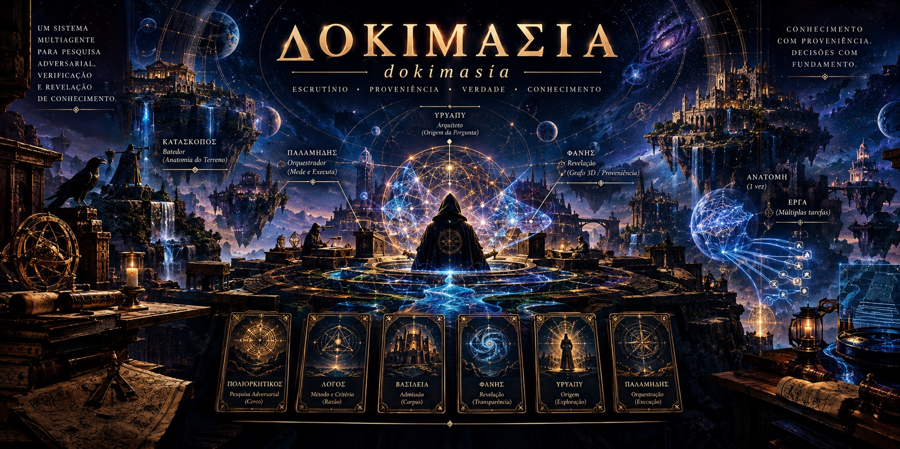
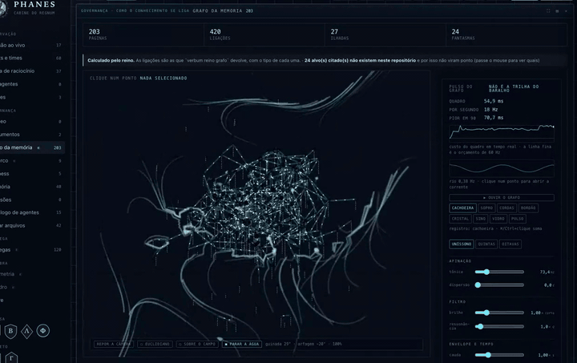
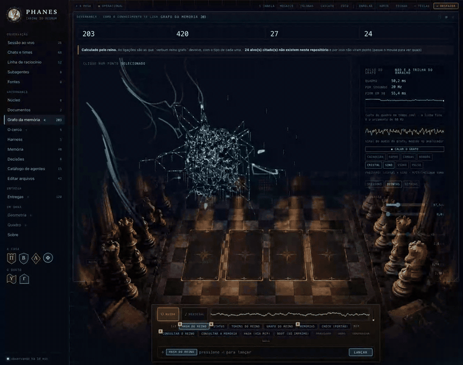
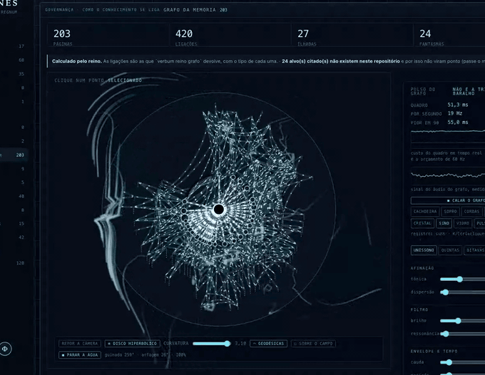
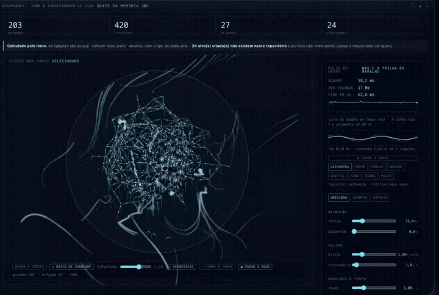
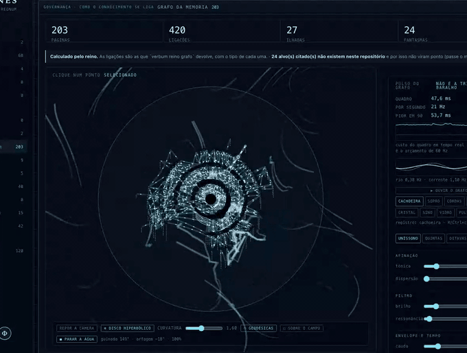

<div align="center">

[Português](README.md) · [English](README.en.md) · **🌐 Español** · [中文](README.zh.md)

</div>

<div align="center">



# ΔΟΚΙΜΑΣΙΑ · dokimasía

**El escrutinio, y lo que revela.**

**ΠΟΛΙΟΡΚΗΤΙΚΟΣ** · **ΛΟΓΟΣ** · **ΒΑΣΙΛΕΙΑ** · **ΦΑΝΗΣ**

[](https://www.youtube.com/watch?v=8xiHYIYnqsM)


▶ **[Ver el vídeo](https://www.youtube.com/watch?v=8xiHYIYnqsM)**
📖 **[La wiki — la arquitectura entera, página por página](https://github.com/poliorketike/dokimasia/wiki)**

</div>

---

## El nombre

**δοκιμασία** era el examen al que Atenas sometía a un ciudadano **antes** de dejarlo ejercer un
cargo público. No era una formalidad, y no era privado.

Según el relato de Aristóteles (*Constitución de los atenienses* 55), al candidato a arconte se le
preguntaba: quién es tu padre, y de qué demo; quién es tu abuelo paterno; quién es tu madre, y de
qué demo su padre; si tienes culto de Apolo Patroos y Zeus Herkeios — **y dónde están esos
santuarios**; si tienes tumbas familiares; si tratas bien a tus padres; si pagas los impuestos; si
cumpliste el servicio militar. Después, **en público y ante la Bulé, se preguntaba si alguien quería
acusarlo** — y solo entonces se votaba a mano alzada.

Eso es, rasgo por rasgo, lo que una página de este corpus debe declarar para entrar:

| la pregunta ateniense | el campo de la página |
|---|---|
| «¿quién es tu padre, de qué demo?» | **procedencia** — la fuente, con origen verificable |
| «¿dónde están los santuarios?» | **direccionabilidad** — la cita debe resolver, no solo alegarse |
| «¿alguien quiere acusar?» | **revisión adversarial** — y de otra familia de modelo |
| la votación, en público | **admisión con dos testigos**, uno de ellos humano |

Y por eso una sola palabra nombra las cuatro capas: **son los cuatro momentos de una única
dokimasía.** Cercar es el examen (`ΠΟΛΙΟΡΚΗΤΙΚΟΣ`), el método son las preguntas (`ΛΟΓΟΣ`), admitir es
el voto (`ΒΑΣΙΛΕΙΑ`), y **que el escrutinio sea público es lo que lo hace escrutinio** (`ΦΑΝΗΣ`).

> Un examen secreto no es un examen: es una decisión con testigo de conveniencia.

<sub>Fuentes: Aristóteles, *Athenaion Politeia* 55 ·
[Todd](https://www.austriaca.at/0xc1aa5576%200x002544b1.pdf) ·
[Adeleye, GRBS](https://grbs.library.duke.edu/index.php/grbs/article/download/5741/5243)</sub>

---

> **Este repositorio es una vitrina, no el código.** Muestra lo que se puede ver, dice lo que hay
> detrás y guarda las referencias. El experimento **se abrirá pronto**; por ahora sigue corriendo, y
> abrir un laboratorio en medio de la medición estropea la medición.

---

## Qué es esto

Un sistema multiagente acumula conocimiento y **no tiene dónde verlo**. Se gastan tokens, corren
agentes, se leen fuentes, se toman decisiones — y nada de eso es visible.

**Phanes** es la consola que lo revela: el grafo de la memoria, el coste real por turno, la
procedencia de cada afirmación y las puertas que el trabajo tuvo que atravesar. En la tradición
órfica, Phanes es la divinidad de la **manifestación** y del **origen ordenado** — el nombre describe
la función: no crea, revela, y revela *ordenado*.

### La tesis, dicha como tesis

> # El conocimiento que no puede caer no es conocimiento: es decoración.

Una afirmación que **ninguna observación posible contradiría** no informa sobre el mundo — informa
sobre quien la escribió. En un sistema multiagente eso deja de ser filosofía y se vuelve ingeniería:
**el modelo produce texto fluido con la misma facilidad con que produce texto verdadero, y la
fluidez no distingue entre los dos.**

Por eso cada página declara, en un campo obligatorio `refutes`, **qué la derribaría**. No
«limitaciones» — eso es retórica. Una **condición observable** que, si ocurre, obliga a revisar.

### Las tres leyes

| | ley | qué prohíbe |
|---|---|---|
| 1 | **Lo que protege es la puerta** | una estructura que describe la regla y no rechaza nada |
| 2 | **Nadie aprueba lo que produjo** | el autoconsentimiento — incluso de quien escribió la puerta |
| 5 | **Regla sin condición de falsación es `assert True`** | la regla que siempre pasa |

### Las cinco clases epistémicas

`OBSERVADO` · `INFERIDO` · `DECLARADO_POR_EL_AUTOR` · `NO_DETERMINABLE` · `REFUTADO`

**La cuarta es la que más importa.** Un sistema que **no tiene** `NO_DETERMINABLE` termina
**inventando** una de las otras cuatro — la presión por responder es estructural, y la forma de una
respuesta no distingue *«medí»* de *«supongo»*.

### La parte política

Un sistema de conocimiento es un sistema de **poder sobre lo que cuenta como verdad**. Por eso: nadie
aprueba lo que produjo; toda promoción exige **dos testigos, uno humano**; el revisor adversarial
debe venir de **otra familia de modelo**, porque un panel de clones concuerda consigo mismo y lo
llama consenso; **la reputación se deriva de eventos registrados**, nunca autoatribuida — un miembro
que nace con insignia nace con fraude; y al creador **no lo describe él mismo** — la tribu lo
describe y él derriba lo que rechace.

Es deliberadamente lento. **El coste de admitir mal es mayor que el de admitir despacio.**

---

## La pirámide

<div align="center">


&nbsp;

&nbsp;&nbsp;

</div>

**Seis cartas, en 1 · 2 · 3** — y la disposición no es estética, es la arquitectura:

| fila | quién | qué hace |
|---|---|---|
| **1 · el vértice** | **ΥΡΥΑΠΥ** — *el sonido del agua* | **abre la pregunta.** Nada empieza sin que alguien quiera saber |
| **2 · los instrumentos** | **ΠΑΛΑΜΗΔΗΣ** — *el gnomon* · **ΛΟΓΟΣ** — *verbum* | **con qué se mide, y por qué método.** Ninguno es un acto: ambos son condición de todos los actos |
| **3 · los actos** | **ΠΟΛΙΟΡΚΗΤΙΚΟΣ** · **ΒΑΣΙΛΕΙΑ** · **ΦΑΝΗΣ** | **cercar · admitir · revelar.** Los únicos que cambian el estado del mundo |

1+2+3 = 6 no es casualidad de recuento: es el tercer número triangular, la misma figura con la que
los pitagóricos decían que un todo se construye por niveles. Aquí cae sola, porque son exactamente
seis.

> El vértice pregunta · la cintura mide · la base actúa.

### Las cartas, en una línea cada una

| | carta | epíteto | qué carga |
|---|---|---|---|
| 〰️ | **ΥΡΥΑΠΥ** | ἀρχιτέκτων · κυβερνήτης | «el sonido del agua» en tupí-guaraní. El arquitecto, y la única puerta humana del sistema |
| 📐 | **ΠΑΛΑΜΗΔΗΣ** | γνώμων · ἔλεγχος | el gnomon — no brilla: **proyecta sombra, y la sombra es la medida**. Ejecuta; nunca aprueba su propio trabajo |
| 🔷 | **ΛΟΓΟΣ** · *verbum* | — | el método antes de la herramienta. Razón *y* proporción: λόγος es las dos cosas |
| 🏰 | **ΠΟΛΙΟΡΚΗΤΙΚΟΣ** | — | el cerco. `πόλις + ἕρκος`: cercar la ciudad con una empalizada. El arte del **recinto** |
| 🛡️ | **ΒΑΣΙΛΕΙΑ** · *regnum* | — | lo que fue admitido. No «poder»: **el dominio de lo que pasó el examen** |
| ⭕ | **ΦΑΝΗΣ** | — | lo que revela. En la teogonía órfica también se le llama Protógonos, Erikepaios y **Metis** |

---

## En movimiento, con sonido

<div align="center">



**[▶ vídeo con audio (39 s, MP4)](av/grafo.mp4)** · **[🎧 solo la sonificación (MP3)](av/grafo.mp3)**

</div>

En el vídeo se **abren siete nodos uno a uno** y se recorre la ficha de cada uno: el tipo de página,
su ruta en el reino, la regla, el porqué, las fuentes con dirección, las entidades y con quién se
enlaza. **El dibujo es el índice; la ficha es el contenido.**

> La banda del MP4 **no es una banda sonora**: es el grafo tocado. Renderizado fuera del navegador
> con el **mismo mapeo** que la consola usa en vivo — grado → altura (el hub es la tónica y el
> grave), nivel BFS → octava y compás, posición → estéreo, escala dórica sobre D2 (73,42 Hz).

### El set de un minuto

<div align="center">


**[▶ set completo, 60 s con audio](av/set.mp4)** · **[🎧 solo el audio](av/set.mp3)**
</div>

Sesenta segundos tocando el grafo como se toca una mesa: **timbres entrando y saliendo**, la
**tónica caminando por los grados de la dórica** (D2 → F2 → A2 → G2 → D2), el **período** de 2,6 s a
1,4 s y de vuelta a 4,0 s, el **registro** pasando de unísono a quintas y a octavas — con **ruido
marrón** (12–24 s) y el **secuenciador medieval** (30–42 s) entrando por encima.

> **La tónica no es aleatoria.** Camina por los grados de la escala, así que los cambios caen
> *dentro* de ella en vez de cortarla. «Aleatorizar» sin escala da cambio, no modulación.

**La partitura es una sola, leída por ambos lados**: el navegador ejecuta los eventos mientras el
vídeo graba, y el renderizador offline lee **los mismos** eventos — *una lectura, dos consumidores*.

### hitech-set — el grafo a 189 BPM

<div align="center">


**[▶ 80 s con audio](av/hitech-set.mp4)** · **[🎧 solo el audio](av/hitech-set.mp3)**
</div>

Psytrance hi-tech construido a partir del grafo, con **tres números organizándolo todo** — cada uno
entrando por la propiedad que de hecho tiene.

#### 142857 — aquí sí

Cuando el campo de flujo necesitó repartir fases, **142857 no sirvió**: su propiedad no es la
distribución. Aquí la pregunta es otra, y es exactamente la suya.

142857 es el período de 1/7, y sus múltiplos 1 a 6 son **rotaciones de los mismos dígitos**:

```
1 × 142857 = 142857          4 × = 571428
2 ×        = 285714          5 × = 714285
3 ×        = 428571          6 × = 857142
7 ×        = 999999   ← el ciclo se rompe, y todos los dígitos saturan a la vez
```

Eso se vuelve la estructura rítmica: **seis compases, cada uno con una rotación de la máscara de
acentos**, y el **séptimo es el drop** — porque 7 × 142857 = 999999. El drop no se puso ahí por
gusto: **es** la séptima fila de la tabla.

#### 189 BPM

**7 × 27**, y 27 = 1+4+2+8+5+7, la suma de los dígitos. Cae dentro del rango del hi-tech (170–200)
sin haber sido elegido de oído. Medido de vuelta en la señal por autocorrelación: **189,0 BPM**.

#### 6 contra 16

La máscara tiene 6 celdas; el compás tiene 16 semicorcheas. Solo vuelven a coincidir cada **48
pasos** (3 compases), y con el ciclo de 7 compases encima la alineación completa tarda **336 pasos —
21 compases**. El polirritmo no se programó: es lo que los dos números producen solos.

#### El color y la afinación

Raga **Bhairav** — S r G m P d N, semitonos 0,1,4,5,7,8,11 — sobre un bordón de **Sa y Pa**. La
tanpura toca en el orden clásico (Pa Sa Sa Sa) con los parciales que hacen el *jivari*. Las razones
son de enteros pequeños — **3/2, 9/8** — las divisiones del monocordio. El color indio viene de ahí,
no de un sample.

#### Y el grafo, que es el insumo

**grado → grado de la raga** (el hub es Sa) · **nivel BFS → octava** y qué voz suena en cada paso ·
**índice del nodo → panorama** · **vigor del campo de flujo → apertura del filtro del bajo**.

### Los tres modelos

El mismo grafo, en tres geometrías. **[▶ los tres en secuencia (35 s)](av/modelos.mp4)**

| | qué es |
|---|---|
| `◻ euclidiano` | la proyección en perspectiva |
| `◎ disco proyectado` | la misma nube 3D llevada al disco — **sigue habiendo cámara y profundidad** |
| `⊚ disco hiperbólico` | **árbol radial calculado en el plano hiperbólico** — sin cámara, sin profundidad |

<div align="center">


</div>

El disco nativo es la técnica del *hyperbolic browser* (Lamping, Rao & Pirolli, CHI 1995): **raíz en
el centro, cada nivel en un anillo**, y cada nodo con una porción angular proporcional al **tamaño de
su subárbol** — no al número de hijos. Si no, una rama con un hijo y cien nietos recibiría la porción
de una hoja, y el dibujo mentiría sobre dónde está la masa del corpus.

> **Una corrección que la medida obligó.** Con la profundidad en saltos crudos, `tanh(κ·d/2)` satura:
> la ρ mediana daba **0,976** y el grafo entero quedaba pegado al horizonte. Normalizada por el
> anillo más profundo, la curvatura vuelve a mandar: p10 **0,217** · mediana **0,414** · p90
> **0,706** · máximo **0,800**, con 203 de 203 dentro.

---

## Después del cerco: lo operacional

El cerco no termina en informe. Termina en **obra** — y el enlace entre ambos es la **convergencia
informacional**.

Un módulo complejo tiene 30 tareas. Cada una exige **entender la anatomía** antes de operar. Treinta
agentes en abanico: **sesenta horas solo de comprensión**, para treinta minutos de ejecución.

**El conocimiento, a diferencia del trabajo, no se divide en partes.** Paralelizar la ejecución tiene
sentido; paralelizar la comprensión es pagar N veces por un bien que no es rival.

La convergencia paga cuando **(N − 1)·C > A + N·ε**. Con C en horas y ε en minutos, el equilibrio cae
en **N ≈ 2**.

### El coste de entrada, medido

| | |
|---|---|
| sesiones con contabilidad de uso | **2.333** |
| contexto en el **primer turno**, antes de trabajo útil | mediana **28.671** tokens · p90 **68.565** |
| sumado | **84,0 M tokens** |
| fracción leída de caché en ese primer turno | **34 %** |

**84 millones de tokens solo para empezar** — y eso es el piso, no la anatomía.

### La doctrina, en vocabulario de cerco

**ΚΑΤΑΣΚΟΠΟΣ** (el explorador: uno, no treinta) → **ΑΝΑΤΟΜΗ** («corte a través»: el artefacto
convergido, que **no es un resumen** — resumen es lo que se pierde; la anatomía es lo que permite
operar sin releer) → **ΕΡΓΑ** (las obras: las tareas reclamadas y ejecutadas).

### El riesgo, que es lo difícil

> **La convergencia cambia coste por fallo correlacionado.**

Treinta lectores independientes **discrepan**, y esa divergencia es un código corrector de errores
que nadie diseñó. Un lector y treinta ejecutores no lo tienen: **si la anatomía está mal, los treinta
se equivocan igual, en la misma dirección y con confianza.**

Es la misma estructura del cuello de botella 4 (*todos los revisores de la misma familia de modelo*).
De ahí las cuatro puertas — incluida la cuarta, que impide que la doctrina sea infalsable: **una de
las N tareas se ejecuta sin la anatomía, leyendo la fuente.**

---

## El eje que atraviesa todo: φιλομαθής ↔ φιλοπράκτωρ

> ⚠️ `φιλομαθής` está atestiguado y es clásico. **`φιλοπράκτωρ` no es un compuesto griego
> atestiguado** — es un neologismo moderno. `πράκτωρ` existe; `φιλοπράγμων` existe pero tiende al
> peyorativo (*entrometido*); lo atestiguado para «amante del trabajo» es `φιλόπονος`. Lo mantenemos
> por precisión semántica y **lo marcamos como composición moderna donde aparece**.

| sola | qué pasa |
|---|---|
| **φιλομαθής** sin φιλοπράκτωρ | investigación infinita. El cerco nunca termina |
| **φιλοπράκτωρ** sin φιλομαθής | ejecución sobre un mapa no examinado — los treinta agentes errando igual |

**La ἀνατομή es la bisagra**: el único artefacto cuya función es convertir una disposición en la
otra. Y por eso **la orquestación no es una fase**: durante lo operacional, quien orquesta sigue
siendo φιλομαθής.

### La razón, medida

Sobre **58.337** llamadas a herramientas, con el clasificador declarado:

| | leer | actuar | razón |
|---|---:|---:|---|
| herramientas inequívocas | 8.380 | 6.363 | **1,32 : 1** |
| con `Bash` (43.595 llamadas) | 13.834 | 44.503 | **0,31 : 1** |
| por sesión (≥20 llamadas, n=96) | | | mediana **13 %** de lectura |

**Las dos líneas discrepan por 4,3× — y la discrepancia es el hallazgo.** El **18 %** de todo lo que
`Bash` ejecuta es medir y probar. Y medir no es ni aprender ni hacer: es el tercer gesto, el del
**gnomon**. Por eso **ΠΑΛΑΜΗΔΗΣ está en la cintura de la pirámide**, junto al método, y no en la base
con los actos.

---

## La casa, en números

Los cuatro repositorios siguen siendo **privados**. Estado de **2026-10-02**, de `git rev-list`,
`gh pr list` y `wc -l` — no de estimación.

| repositorio | papel | commits | PRs | desde |
|---|---|---:|---:|---|
| **ΛΟΓΟΣ** · `verbum` | el método | **367** | 47 | 2025-12-20 |
| **ΦΑΝΗΣ** · `phanes` | la consola | **57** | 3 | 2026-09-05 |
| **ΠΟΛΙΟΡΚΗΤΙΚΟΣ** · `poliorketikos` | la investigación | **130** | 17 | 2026-09-17 |
| **ΒΑΣΙΛΕΙΑ** · `regnum` | lo admitido | **486** | 105 | 2026-09-17 |
| | **total** | **1.040** | **172** | **286 días** |

202 páginas · 420 enlaces tipados · 292 pruebas · 13 puertas de CI · 29.940 líneas de Rust ·
27 skills · 15 agentes.

**Lo que estos números dicen**: hubo volumen y hubo puerta — **una revisión cada 6 commits**.
**Lo que no dicen**: que el conocimiento haya mejorado.

---

## Lo que este proyecto **no** afirma

- **La tesis central no está verificada.** No hay ground truth de aprendizaje — ninguna medida de
  capacidad antes y después. Mientras no la haya, la tesis sigue **no verificada**, y ningún volumen
  de commits sustituye esa medida.
- **La disposición de los puntos no es semántica.** Es equilibrio de muelles. Lo que afirma relación
  es la **arista**.
- **El campo de flujo no es una simulación de fluidos.** No hay Navier–Stokes.
- **El agua no transporta nada medido.** Lo que corre es la topología.
- **El sonido no es análisis.** Oír el grafo no sustituye leerlo.
- **24 objetivos citados no existen** en este repositorio; el medidor «fantasmas» los cuenta a la
  cara.

### Los seis cuellos de botella

1 convergencia cara (**+13 palabras** por reenvío) · 2 coordinación entre sesiones · 3 estimaciones
del agente aceptadas sin verificación · 4 **revisores todos de la misma familia de modelo** ·
5 secretos pegados en el prompt bajo urgencia · 6 **G4 — ningún ground truth de aprendizaje**.

**La fila 6 está vacía a propósito.** Es la misma regla del tablero del cerco — *la casilla vacía es
el hallazgo* — aplicada a la propia casa.

---

## Referencias

**Poliorcética** · Eneas Táctico · Filón de Bizancio, *Mechanike Syntaxis* IV–V · Apolodoro de
Damasco · Francesco di Giorgio Martini · Tucídides

**La dokimasía** · Aristóteles, *Constitución de los atenienses* 55 ·
[Todd](https://www.austriaca.at/0xc1aa5576%200x002544b1.pdf) ·
[Adeleye, GRBS](https://grbs.library.duke.edu/index.php/grbs/article/download/5741/5243)

**Epistemología** · Popper · Platón, los diálogos aporéticos · Shafer & Vovk · Tetlock · Brooks

**Grafo y geometría** · Fruchterman & Reingold (1991) · **Lamping, Rao & Pirolli (CHI 1995)** ·
Munzner (1998)

**Arte generativo y fluidos** ·
[`23x2/generative-flow-field`](https://github.com/23x2/generative-flow-field) (MIT) — la referencia
directa · [`emooney/fluid-sim`](https://github.com/emooney/fluid-sim) — **evaluado y no adoptado** ·
Jos Stam (1999) · Vogel (1979)

**Sonido** · John Chowning, *síntesis FM* (1973) · Kramer (ed.), *Auditory Display*

---

<div align="center">

### Pronto, código abierto

*El experimento sigue corriendo. Abrir el laboratorio en medio de la medición estropea la medición.*

**[▶ el vídeo](https://www.youtube.com/watch?v=8xiHYIYnqsM)** · **[📖 la wiki](https://github.com/poliorketike/dokimasia/wiki)**

</div>
