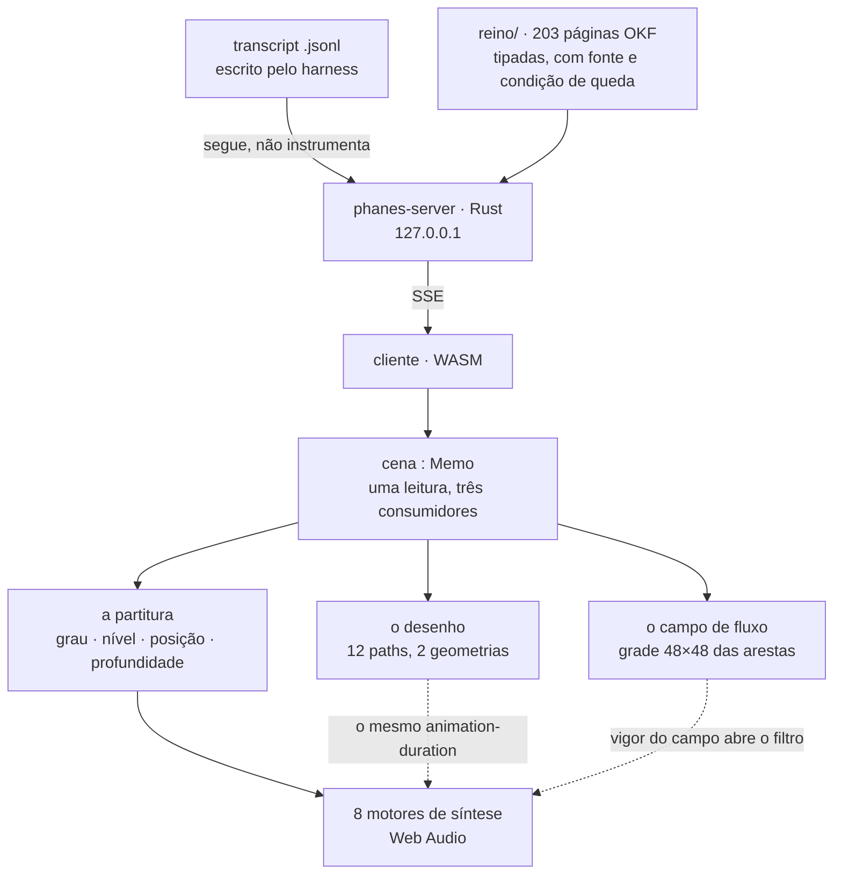
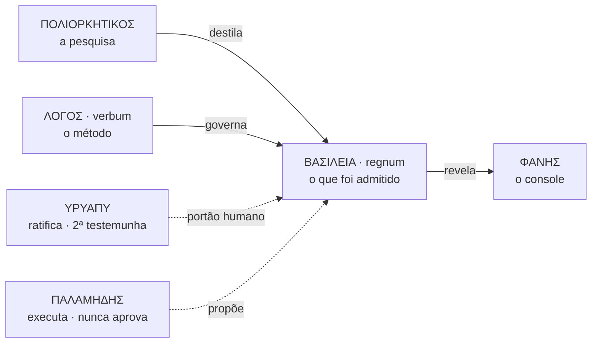

# ΦΑΝΗΣ · Phanes says hello to world

**Um console audiovisual para a memória de um sistema multiagente.**
*An audiovisual console for the memory of a multi-agent system.*

▶ **[Assista ao vídeo](https://www.youtube.com/watch?v=8xiHYIYnqsM)** · *[Watch the video](https://www.youtube.com/watch?v=8xiHYIYnqsM)*

---

> **Este repositório é uma vitrine, não o código.** Ele mostra o que dá para ver, diz o que há por
> trás e guarda as referências. O experimento **será aberto em breve**; por enquanto ainda está
> rodando, e abrir um laboratório no meio da medição estraga a medição.
>
> **This repository is a showcase, not the source.** It shows what can be seen, says what is behind
> it, and keeps the references. The experiment **will be open-sourced soon**; for now it is still
> running, and opening a lab mid-measurement ruins the measurement.

---

## PT-BR

### O que é

Um sistema multiagente acumula conhecimento e **não tem onde vê-lo**. Os tokens são gastos, os
agentes rodam, as fontes são lidas, as decisões são tomadas — e nada disso é visível. **Phanes** é o
console que revela isso: o grafo da memória, o custo real por turno, a proveniência de cada
afirmação e os portões que o trabalho precisou atravessar.

Na tradição órfica, Phanes é a divindade da **manifestação** e da **origem ordenada**. O nome
descreve a função: ele não cria, revela — e revela *ordenado*.

O que o vídeo mostra é o **módulo do grafo**: 203 páginas de conhecimento, 420 ligações tipadas,
desenhadas em duas geometrias, com a corrente de água correndo pelas ligações e **o grafo sendo
tocado como instrumento**.

### A tese, dita como tese

> Conhecimento que não pode cair não é conhecimento: é decoração.

Três leis operam o sistema, e todas são negativas — dizem o que **não** passa:

1. **O que protege é o portão.** Uma estrutura sem um portão que reprove não protege nada.
2. **Regra sem condição de falsificação é `assert True`.** Toda página do corpus declara o que a
   derrubaria. Se não declara, não entra.
3. **Número digitado onde havia número derivável é defeito.** Se dá para medir, medir.

E cinco classes epistêmicas marcam cada afirmação:
`OBSERVADO` · `INFERIDO` · `DECLARADO_PELO_AUTOR` · `NAO_DETERMINAVEL` · `REFUTADO`.

A quarta é a mais importante. **"Não determinável" é uma resposta**, e um sistema que não a tem
acaba inventando as outras quatro.

### A parte política

Um sistema de conhecimento é um sistema de **poder sobre o que é verdade**. Por isso:

- **ninguém aprova o que produziu** — nem humano, nem agente;
- **toda promoção ao corpus exige duas testemunhas, e uma é humana**;
- o revisor crítico tem de ser de **outra família de modelo**, porque um painel de clones concorda
  consigo mesmo e chama isso de consenso;
- **a reputação é derivada de evento registrado**, nunca autoatribuída. Membro que nasce com badge
  nasce com fraude;
- o criador **não é descrito por ele mesmo** — a tribo o descreve e ele derruba o que rejeitar.

É deliberadamente lento. O custo de admitir errado é maior que o de admitir devagar.

### As quatro camadas, e o dueto

| | | o que é |
|---|---|---|
| 🏰 | **ΠΟΛΙΟΡΚΗΤΙΚΟΣ** · *poliorketikos* | A pesquisa. A **poliorcética** grega não era "construir máquinas de cerco": era um sistema adversarial inteiro, com oito gestos do atacante contra oito do defensor. Cruzados dão 64 pares, e a casa vazia é o achado — ela diz onde não há mecanismo. |
| 🛡️ | **ΒΑΣΙΛΕΙΑ** · *regnum* | O reino: o que foi **admitido**. Um corpus de páginas tipadas, com fonte, condição de queda e relações explícitas (`estende`, `converge`, `corrige`, `contradiz`). Nada entra sem passar pelo portão. |
| 🔷 | **ΛΟΓΟΣ** · *verbum* | A palavra: o **método** antes da ferramenta. Fonte com origem, decisão com alternativa, previsão com probabilidade, erro com registro. É o que sobra quando se tira o software. |
| ⭕ | **ΦΑΝΗΣ** · *phanes* | O console: o que **revela**. Não instrumenta nada, não intercepta nada — segue o que o sistema já escreve em disco e publica. |

E os dois que não são camada de software, porque são **quem opera**:

| | | |
|---|---|---|
| 〰️ | **ΥΡΥΑΠΥ** · *yryapu* | "O som da água" em tupi-guarani. O arquiteto. 9.323 prompts em 142 dias corridos, com atividade em 119 deles — e a curva não tem manhã: a madrugada é mais densa que o período das 6h às 11h. |
| 📐 | **ΠΑΛΑΜΗΔΗΣ** · *palamedes* | O gnômon — a haste do relógio de sol, que não brilha: **projeta sombra, e a sombra é a medida**. O agente orquestrador. Autoridade de executar, nunca de aprovar o próprio trabalho. |

---

### O que se vê no vídeo

#### O grafo da memória, em duas geometrias

203 páginas, **420 ligações tipadas**, 27 ilhadas e **24 fantasmas** — alvos citados que não
existem neste repositório, contados na cara em vez de escondidos. O layout é por forças em 3D com
semente fixa: a figura é a mesma a cada carga, para dar para voltar nela e comparar.

A disposição dos pontos **não é semântica**. Duas páginas próximas na tela não são "parecidas" — é
equilíbrio de molas. O que afirma relação é a **aresta**, e ela é tipada.

#### O disco de Poincaré

O mesmo grafo em geometria hiperbólica: ρ = tanh(κ·d/2), com o horizonte a distância infinita —
nenhum ponto o alcança. As arestas são **geodésicas**: arcos ortogonais ao horizonte, que é o que o
modelo chama de reta. Desenhar segmentos retos mostraria distâncias que o modelo não afirma, e por
isso o botão "retas" existe: para ver a diferença, não para fingir que não há.

**Por que serve a este corpus**: numa estrutura hierárquica o número de páginas cresce
exponencialmente com a distância ao centro — e é exatamente isso que a geometria hiperbólica
acomoda sem amontoar.

#### A água, e o campo de fluxo

Cada ligação é um **túnel** com água correndo dentro, do nó mais central para o mais periférico — a
direção vem de uma busca em largura a partir do nó de maior grau. O campo de partículas por cima é
um *flow field*, mas o campo vetorial **não é ruído**: cada aresta deposita a própria direção numa
grade, e o ruído entra só como perturbação. A partícula corre **pelos túneis**.

Um flow field puramente decorativo diria algo falso: que há movimento onde não há ligação.

As fases usam a **razão áurea** — a parte fracionária dos múltiplos de φ é a sequência de menor
discrepância em uma dimensão, e o ângulo áureo faz o mesmo no disco (é a filotaxia do girassol).
Aleatório agruparia; uniforme bateria, e batimento é piscar com período.

#### O grafo tocado

**Sonificação, não trilha.** Cada som vem de uma medida do corpus:

| medida | parâmetro |
|---|---|
| **grau** da página | altura — o hub é a **tônica** e o grave: a página mais ligada é a fundação |
| **nível** na busca | oitava e passo do compasso — em fase com a água na tela |
| **posição** na tela | panorâmica estéreo — girar o grafo move o som |
| **profundidade** | volume e corte do filtro |
| **ponto escolhido** | a corredeira: os vizinhos entram em contratempo |

Oito motores de síntese (ruído por passa-banda que segue a altura, FM inarmônica 1:√2 para o sino,
aditivo com as parciais do vidro, serras desafinadas…), empilháveis como registros de órgão, e o
compasso **não é digitado**: é o `animation-duration` da água. Mexer na correnteza muda o
andamento, porque é literalmente o mesmo número.

#### O cerco

Os 64 pares do tratado, e **a casa vazia é o achado**: ela diz onde esta casa *não* tem mecanismo.
O número dentro de cada peça é medido; a colocação da peça é declarada — e as duas coisas ficam
separadas de propósito, porque uma é dado e a outra é leitura.

#### A mesa, e o trilho

---

### A arquitetura, em um desenho

**A `cena` é um memo só, e os três consumidores leem dela.** Isso não é organização, é portão: duas
fontes para o mesmo número é a próxima divergência esperando acontecer. O som estar em fase com o
desenho é **consequência de lerem a mesma leitura**, não de alguém ter copiado um valor.

### A linhagem

---

### O que este projeto **não** afirma

Esta seção é a que mais importa, e é por isso que ela está aqui e não escondida no fim.

- **A tese central não está verificada.** A ideia é que o corpus e as ferramentas *amplifiquem* o
  trabalho, e não apenas o acelerem. Não há **ground truth de aprendizagem** — nenhuma medida de
  capacidade antes e depois. Enquanto não houver, a tese permanece **não verificada**, e nenhum
  volume de commit ou fluência de sessão substitui essa medida. É a próxima coisa a construir.
- **A disposição dos pontos não é semântica.** É equilíbrio de molas.
- **O campo não é uma simulação de fluido.** Não há Navier–Stokes, não há pressão nem vorticidade.
- **A água não transporta nada medido.** O que corre é a topologia, não um volume.
- **O som não é análise.** Ouvir o grafo não substitui ler o grafo — é uma segunda via sensorial.

### Os gargalos conhecidos

Declarados, com mecanismo quando há: convergência cara · coordenação entre sessões · estimativas do
agente aceitas sem verificação · **revisores todos da mesma família de modelo** · segredo no prompt
sob urgência · e o que trava tudo: **nenhum ground truth de aprendizagem**.

---

## EN

### What this is

A multi-agent system accumulates knowledge and **has nowhere to see it**. Tokens are spent, agents
run, sources are read, decisions are made — and none of it is visible. **Phanes** is the console
that reveals it: the memory graph, the real cost per turn, the provenance of every claim, and the
gates the work had to pass.

In the Orphic tradition, Phanes is the deity of **manifestation** and of **ordered origin**. The
name describes the function: it does not create, it reveals — and it reveals *ordered*.

The video shows the **graph module**: 203 knowledge pages, 420 typed links, drawn in two geometries,
with water current running through the links and **the graph played as an instrument**.

### The thesis, stated as a thesis

> Knowledge that cannot fall is not knowledge — it is decoration.

Three laws run the system, and all three are negative — they say what does **not** get through:

1. **What protects is the gate.** A structure with no gate that rejects protects nothing.
2. **A rule without a falsification condition is `assert True`.** Every page in the corpus declares
   what would bring it down. If it doesn't declare it, it doesn't get in.
3. **A typed number where a derivable one existed is a defect.** If it can be measured, measure it.

And five epistemic classes mark every claim: `OBSERVED` · `INFERRED` · `AUTHOR-DECLARED` ·
`NOT-DETERMINABLE` · `REFUTED`. The fourth matters most. **"Not determinable" is an answer**, and a
system without it ends up inventing one of the other four.

### The political part

A knowledge system is a system of **power over what counts as true**. Therefore:

- **nobody approves what they produced** — neither human nor agent;
- **every promotion into the corpus needs two witnesses, and one is human**;
- the adversarial reviewer must come from **another model family**, because a panel of clones agrees
  with itself and calls it consensus;
- **reputation is derived from recorded events**, never self-assigned. A member born with a badge is
  born with a fraud;
- the creator **is not described by himself** — the tribe describes him and he strikes out what he
  rejects.

It is deliberately slow. The cost of admitting wrongly is higher than the cost of admitting slowly.

### The four layers, and the duet

| | what it is |
|---|---|
| **ΠΟΛΙΟΡΚΗΤΙΚΟΣ** · *poliorketikos* | The research. Greek **poliorcetics** was never "building siege engines": it was a whole adversarial system — eight attacker gestures against eight defender ones. Crossed, they give 64 pairs, and **the empty square is the finding**: it says where no mechanism exists. |
| **ΒΑΣΙΛΕΙΑ** · *regnum* | The kingdom: what has been **admitted**. A corpus of typed pages with sources, falsification conditions, and explicit relations (`extends`, `converges`, `corrects`, `contradicts`). Nothing enters without passing the gate. |
| **ΛΟΓΟΣ** · *verbum* | The word: the **method** before the tooling. Sources with origin, decisions with alternatives, predictions with probability, errors with a record. It is what remains when you remove the software. |
| **ΦΑΝΗΣ** · *phanes* | The console: what **reveals**. It instruments nothing and intercepts nothing — it follows what the system already writes to disk, and publishes it. |

And the two that are not software layers, because they are **who operates**:

| | |
|---|---|
| **ΥΡΥΑΠΥ** · *yryapu* | "The sound of water" in Tupi-Guarani. The architect. 9,323 prompts across 142 consecutive days, active on 119 of them — and the curve has no morning: the small hours are denser than 6–11 AM. |
| **ΠΑΛΑΜΗΔΗΣ** · *palamedes* | The gnomon — the sundial's rod, which does not shine: **it casts a shadow, and the shadow is the measurement**. The orchestrating agent. Authority to execute, never to approve its own work. |

### What you see in the video

**The memory graph** — 203 pages, 420 typed links, 27 islanded, and **24 ghosts**: cited targets
that do not exist in this repository, counted openly rather than hidden. Force-directed 3D layout
with a fixed seed, so the figure is identical on every load and can be compared.

**The Poincaré disk** — ρ = tanh(κ·d/2), horizon at infinite distance, edges drawn as **geodesics**
(arcs orthogonal to the horizon, which is what the model calls a straight line). Hyperbolic geometry
fits a hierarchical corpus because page count grows exponentially with distance from the centre.

**The water and the flow field** — each link is a tunnel with current running from the more central
node to the more peripheral one (direction from a breadth-first search). The particle field above is
a flow field, but the vector field **is not noise**: each edge deposits its own direction into a
grid, and noise only perturbs it. Particles run **through the tunnels**. A purely decorative flow
field would state something false: that there is movement where there is no link. Phases use the
**golden ratio** — the fractional parts of its multiples are the lowest-discrepancy sequence in one
dimension, and the golden angle does the same on the disk (sunflower phyllotaxis).

**The graph, played** — sonification, not a soundtrack. Degree → pitch (the hub is the **tonic** and
the bass: the most-linked page is the foundation). BFS level → octave and beat. Screen position →
stereo pan. Depth → volume and filter cutoff. Eight synthesis engines, stackable like organ stops.
The tempo is **not typed**: it is the water's `animation-duration`. Change the current and the tempo
changes, because it is literally the same number.

### What this project does **not** claim

- **The central thesis is not verified.** The claim is that the corpus and tooling *amplify* the
  work rather than merely accelerate it. There is **no ground truth for learning** — no capability
  measurement before and after. Until there is, the thesis stays **unverified**, and no amount of
  commits or session fluency substitutes for that measurement.
- **Node placement is not semantic.** It is spring equilibrium. Only the **edge** asserts a relation.
- **The field is not a fluid simulation.** No Navier–Stokes, no pressure, no vorticity.
- **The water carries nothing measured.** What flows is topology, not volume.
- **Sound is not analysis.** Hearing the graph does not replace reading it.

---

## Referências / References

**A poliorcética e o cerco**
- Eneias Tático, *Poliorcética* (séc. IV a.C.) — o primeiro tratado de defesa de posição
- Fílon de Bizâncio, *Mechanike Syntaxis*, livros IV–V (séc. III a.C.) — fortificação e cerco
- Apolodoro de Damasco, *Poliorcetica* (séc. II d.C.)
- Francesco di Giorgio Martini, *Trattato di architettura civile e militare* (séc. XV)

**Epistemologia e método**
- Karl Popper, *The Logic of Scientific Discovery* — a condição de falsificação
- Glenn Shafer & Vladimir Vovk, *Game-Theoretic Foundations for Probability* — previsão como aposta
- Philip Tetlock, *Superforecasting* — calibração e escore de Brier
- Boécio, *De consolatione philosophiae* — a figura que abre a carta do verbum

**Grafo e geometria**
- Fruchterman & Reingold, *Graph Drawing by Force-Directed Placement* (1991)
- Lamping, Rao & Pirolli, *A Focus+Context Technique Based on Hyperbolic Geometry* (CHI 1995) — o
  argumento do disco para hierarquias
- Munzner, *Exploring Large Graphs in 3D Hyperbolic Space* (1998)

**Arte generativa e fluidos**
- [`23x2/generative-flow-field`](https://github.com/23x2/generative-flow-field) — MIT. O modelo de
  traços longos re-traçados por um campo de ruído; a referência direta do campo de fluxo aqui
- [`emooney/fluid-sim`](https://github.com/emooney/fluid-sim) — Navier–Stokes estável. Avaliado e
  **não** adotado: simula um fluido que não é o nosso dado
- Jos Stam, *Stable Fluids* (SIGGRAPH 1999)
- Roger Penrose sobre ladrilhamento e φ; Vogel, *A better way to construct the sunflower head* (1979)
  — a filotaxia por ângulo áureo

**Som**
- John Chowning, *The Synthesis of Complex Audio Spectra by Means of Frequency Modulation* (1973) —
  a FM do sino
- Gregory Kramer (org.), *Auditory Display: Sonification, Audification and Auditory Interfaces*

---

### Em breve, open source · Open source soon

*O experimento ainda está rodando. Abrir o laboratório no meio da medição estraga a medição.*
*The experiment is still running. Opening the lab mid-measurement ruins the measurement.*

**[▶ o vídeo](https://www.youtube.com/watch?v=8xiHYIYnqsM)**

`#yryapu` `#verbum` `#regnum` `#poliorketikos` `#phanes` `#palamedes`

