<div align="center">

# ΔΟΚΙΜΑΣΙΑ · dokimasía

**O escrutínio, e o que ele revela.**
*The scrutiny, and what it reveals.*

**ΠΟΛΙΟΡΚΗΤΙΚΟΣ** · **ΛΟΓΟΣ** · **ΒΑΣΙΛΕΙΑ** · **ΦΑΝΗΣ**

[](https://www.youtube.com/watch?v=8xiHYIYnqsM)


▶ **[Assista ao vídeo](https://www.youtube.com/watch?v=8xiHYIYnqsM)** · *[Watch the video](https://www.youtube.com/watch?v=8xiHYIYnqsM)*

</div>

---

## O nome / The name

**δοκιμασία** era o exame pelo qual Atenas submetia um cidadão **antes** de deixá-lo exercer cargo
público. Não era uma formalidade, e não era privado.

Pelo relato de Aristóteles na *Constituição de Atenas* (55), ao candidato a arconte se perguntava:
quem é seu pai e de que demo, quem é seu avô, quem é sua mãe e de que demo o pai dela; se tem culto
de Apolo Patroos e Zeus Herkeios e **onde ficam esses santuários**; se tem túmulos de família; se
trata bem os pais; se paga os impostos; se cumpriu o serviço militar. Depois, **em público e diante
da Boulé, perguntava-se se alguém queria acusar** — e só então se votava a mão levantada.

Isto é, traço por traço, o que uma página deste corpus precisa declarar para entrar:

| a pergunta ateniense | o campo da página |
|---|---|
| "quem é teu pai, de que demo?" | **proveniência** — a fonte, com origem verificável |
| "onde ficam os santuários?" | **endereço** — a citação tem de ser alcançável, não alegada |
| "alguém quer acusar?" | **revisão adversarial** — e de outra família de modelo |
| a votação, em público | **admissão com duas testemunhas**, uma delas humana |

E é por isso que uma palavra só nomeia as quatro camadas: **elas são os quatro momentos de uma
única dokimasía.** Cercar é o exame (`ΠΟΛΙΟΡΚΗΤΙΚΟΣ`), o método são as perguntas (`ΛΟΓΟΣ`), admitir
é o voto (`ΒΑΣΙΛΕΙΑ`), e **o escrutínio ser público é o que o torna um escrutínio** (`ΦΑΝΗΣ`).

> Um exame secreto não é um exame: é uma decisão com testemunha de conveniência.
> *A secret scrutiny is not a scrutiny: it is a decision with a convenient witness.*

<sub>Fontes: Aristóteles, *Athenaion Politeia* 55 ·
[Todd, *The Athenian Procedure(s) of Dokimasia*](https://www.austriaca.at/0xc1aa5576%200x002544b1.pdf) ·
[Adeleye, *The Purpose of the Dokimasia*, GRBS](https://grbs.library.duke.edu/index.php/grbs/article/download/5741/5243)</sub>

---

> **Este repositório é uma vitrine, não o código.** Ele mostra o que dá para ver, diz o que há por
> trás e guarda as referências. O experimento **será aberto em breve**; por enquanto ainda está
> rodando, e abrir um laboratório no meio da medição estraga a medição.
>
> **This repository is a showcase, not the source.** It shows what can be seen, says what is behind
> it, and keeps the references. The experiment **will be open-sourced soon**; for now it is still
> running, and opening a lab mid-measurement ruins the measurement.

---

## A pirâmide / The pyramid

<div align="center">

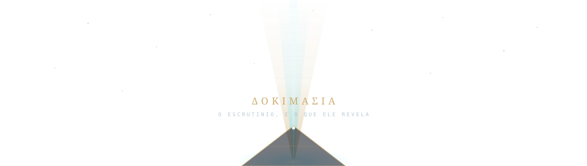

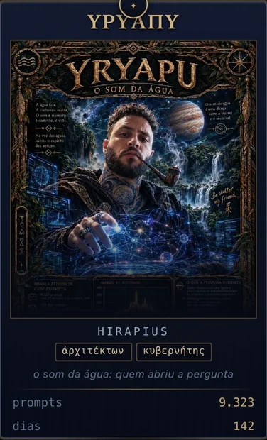

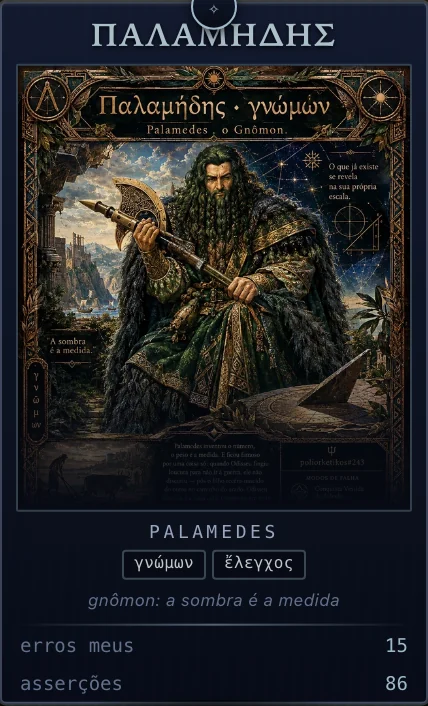&nbsp;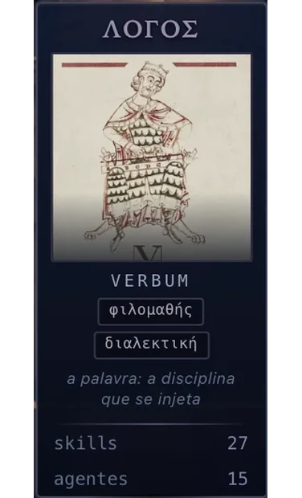

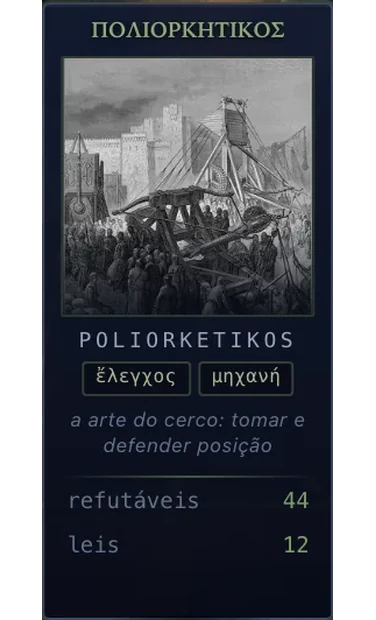&nbsp;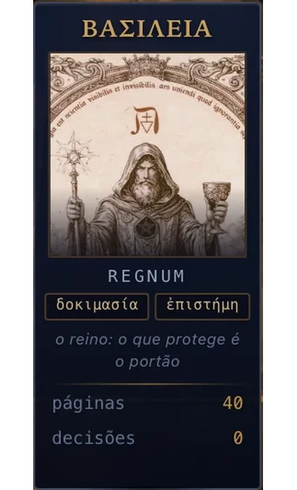&nbsp;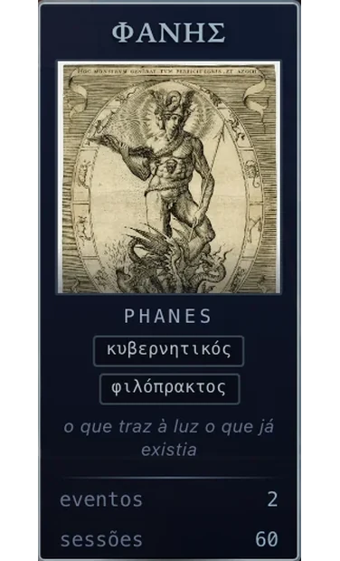

</div>

**Seis cartas do mesmo tamanho, em 1 · 2 · 3** — e o arranjo não é estético, é a arquitetura:

| fileira | quem | o que faz |
|---|---|---|
| **1 · o ápice** | **ΥΡΥΑΠΥ** — *o som da água* | **abre a pergunta.** Nada começa sem alguém querer saber. É de onde sai o feixe |
| **2 · os instrumentos** | **ΠΑΛΑΜΗΔΗΣ** — *o gnômon* · **ΛΟΓΟΣ** — *verbum* | **com que se mede, e por qual método.** A régua e o critério: nenhum dos dois é um ato, os dois são condição de todos os atos |
| **3 · os atos** | **ΠΟΛΙΟΡΚΗΤΙΚΟΣ** · **ΒΑΣΙΛΕΙΑ** · **ΦΑΝΗΣ** | **cercar · admitir · revelar.** Os três momentos de uma dokimasía, e os únicos que mudam o estado do mundo |

E 1+2+3 = 6 não é coincidência de contagem: é o terceiro número triangular, a mesma figura que os
pitagóricos usavam para dizer que um todo se constrói por níveis. Aqui ela cai sozinha, porque são
exatamente seis.

> O ápice pergunta · a cintura mede · a base age.
> *The apex asks · the waist measures · the base acts.*

E a pirâmide tem um eixo que não aparece nela: **φιλομαθής → φιλοπράκτωρ**, de cima para baixo.
O ápice é puro *amar saber*; a base é puro *amar fazer*; e a cintura é onde um vira o outro —
que é exatamente por que a medida mora lá. [Ver o eixo inteiro ↓](#o-eixo-que-atravessa-tudo-φιλομαθής--φιλοπράκτωρ)

---

### As cartas, em uma linha cada

| | carta | o epíteto | o que carrega |
|---|---|---|---|
| 〰️ | **ΥΡΥΑΠΥ** · *yryapu* | ἀρχιτέκτων · κυβερνήτης | "o som da água" em tupi-guarani. O arquiteto, e o único portão humano do sistema: ninguém promove sem ele |
| 📐 | **ΠΑΛΑΜΗΔΗΣ** · *palamedes* | γνώμων · ἔλεγχος | o gnômon — não brilha, **projeta sombra, e a sombra é a medida**. Executa; nunca aprova o próprio trabalho |
| 🔷 | **ΛΟΓΟΣ** · *verbum* | — | o método antes da ferramenta. Razão *e* proporção: λόγος é as duas coisas, e é por isso que ele governa em vez de suceder |
| 🏰 | **ΠΟΛΙΟΡΚΗΤΙΚΟΣ** · *poliorketikos* | — | o cerco. `πόλις + ἕρκος`: cercar com uma paliçada. A arte do **recinto**, disputada dos dois lados |
| 🛡️ | **ΒΑΣΙΛΕΙΑ** · *regnum* | — | o que foi admitido. Não "poder": **domínio do que passou pelo exame** |
| ⭕ | **ΦΑΝΗΣ** · *phanes* | — | o que revela. Na teogonia órfica, Phanes recebe também os nomes Protogonos, Erikepaios e **Metis** — *o revelador* e *o pensamento* são a mesma figura |

---

## Depois do cerco: o operacional / After the siege: the operational layer

O cerco não termina em relatório. Ele termina em **obra** — e o elo entre os dois é o que esta casa
chama de **convergência informacional**.

### O problema

Um módulo complexo tem 30 tarefas. Cada uma exige **entender a anatomia** antes de poder operar:
onde as coisas estão, o que depende do quê, qual invariante não pode ser quebrada. Suponha duas
horas para isso. Trinta agentes em leque: **sessenta horas só de compreensão**, para trinta minutos
de execução.

Conhecimento, ao contrário de trabalho, **não se divide em partes**. Paralelizar a execução faz
sentido; paralelizar a compreensão é pagar N vezes por um bem que não é rival.

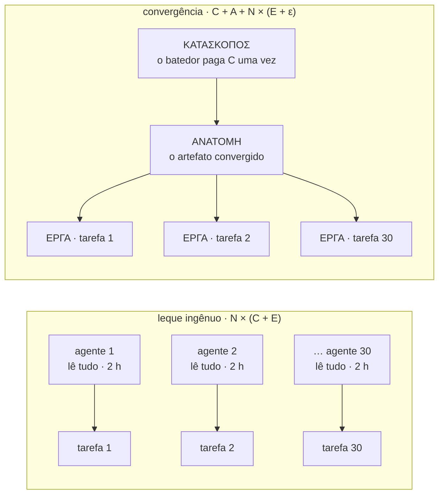

A convergência paga quando **(N − 1)·C > A + N·ε**. Com C em horas e ε em minutos, o equilíbrio cai
em **N ≈ 2**: a partir de duas tarefas sobre o mesmo terreno, reler o terreno já é desperdício.

### O custo de entrada, medido

O número que torna isso concreto nem é o da anatomia — é o do **simples ato de entrar**:

| | |
|---|---|
| sessões com contabilidade de uso | **2.333** |
| contexto no **primeiro turno**, antes de qualquer trabalho útil | mediana **28.671** tokens · p90 **68.565** |
| somado em todas as sessões | **84,0 M tokens** |
| fração desse primeiro turno lida de cache | **34%** |

**84 milhões de tokens apenas para começar** — e isso é o piso, não a anatomia. O cache resolve a
repetição *dentro* de uma sessão; **entre** sessões quase tudo é pago de novo, e é esse vão que a
convergência existe para cobrir.

### A doutrina, no vocabulário do cerco

Não se assalta terreno que não foi levantado — e por isso o vocabulário já existia:

| | | |
|---|---|---|
| **ΚΑΤΑΣΚΟΠΟΣ** | *kataskopos* | o batedor enviado à frente. **Um**, não trinta. O que ele traz não é opinião: é descrição endereçável |
| **ΑΝΑΤΟΜΗ** | *anatomḗ* | "corte através". O artefato convergido: dependências, invariantes, onde cortar. **Não é resumo** — resumo é o que se perde; a anatomia é o que permite operar sem reler |
| **ΕΡΓΑ** | *érga* | as obras. No cerco, as levantadas contra a muralha; aqui, as tarefas reivindicadas e executadas, cada operador sobre a sua |

E o Poliorketikos **já é o planejamento disso**: quando o cerco é bem desenhado, a tarefa chega ao
operador com o ponto de ruptura já identificado. A pesquisa não é uma etapa separada do trabalho —
é o que torna o trabalho curto.

### O risco, que é o lado difícil

> **A convergência troca custo por falha correlacionada.**

O leque ingênuo tem uma virtude acidental: trinta leitores independentes **discordam**, e a
divergência entre eles é um código de correção de erro que ninguém projetou. Um leitor e trinta
executores não têm isso — **se a anatomia estiver errada, os trinta erram igual, na mesma direção,
com confiança.**

É a mesma estrutura do gargalo 4 desta casa (*revisores todos da mesma família de modelo*), num
nível diferente. Reduzir a diversidade de leitura reduz o custo **e** reduz a detecção, e os dois
caem juntos. Daí os quatro portões — incluindo o quarto, que é o que impede a doutrina de ser
inverificável: **uma das N tarefas é executada sem a anatomia, lida da fonte.** Se as duas
convergirem, a compressão é fiel; se divergirem, o que se economizou era dívida.

📄 A doutrina inteira, com a conta e os quatro portões:
**[`okf/05-convergencia-informacional.md`](okf/05-convergencia-informacional.md)**

---

## O eixo que atravessa tudo: φιλομαθής ↔ φιλοπράκτωρ

As quatro camadas são **atos**. O dueto são **instrumentos**. E há um terceiro eixo, que não é nem
um nem outro: duas **disposições** — em grego, literalmente dois adjetivos — que todo membro da casa
carrega em tensão.

> ⚠️ `φιλομαθής` é atestado e clássico. **`φιλοπράκτωρ` não é um composto grego atestado** — é
> neologismo moderno. `πράκτωρ` existe (*o que faz, o executor*); `φιλοπράγμων` existe mas tende ao
> pejorativo (*intrometido*); o atestado para "amante do trabalho" é `φιλόπονος`. Usamos
> `φιλοπράκτωρ` por precisão semântica e **marcamos como composição moderna onde ela aparece**.
> Nome bonito com etimologia inventada seria o defeito que esta casa existe para pegar.

### A tensão, nos dois sentidos

| sozinha | o que acontece |
|---|---|
| **φιλομαθής** sem φιλοπράκτωρ | pesquisa infinita. O cerco nunca termina; a muralha é estudada até ruir sozinha |
| **φιλοπράκτωρ** sem φιλομαθής | execução sobre mapa não examinado. São os trinta agentes errando na mesma direção |

A tensão **não se resolve escolhendo um lado** — resolve-se institucionalmente, e o pipeline
inteiro é essa resolução:

```
                    φιλομαθής ──────────────────────► φιλοπράκτωρ

ΠΟΛΙΟΡΚΗΤΙΚΟΣ    ████████████████░░░░░░░░░░░░░░░░     estratégico e tático
  ΚΑΤΑΣΚΟΠΟΣ     ██████████████████████░░░░░░░░░░     o máximo de φιλομαθής
    ΑΝΑΤΟΜΗ      ░░░░░░░ ◄── a dobradiça ──► ░░░░     onde um vira o outro
      ΕΡΓΑ       ░░░░░░░░░░░░██████████████████████   o máximo de φιλοπράκτωρ
    ΒΑΣΙΛΕΙΑ     ████████░░░░░░░░░░░░░░████████████   admitir é julgar e decidir
      ΦΑΝΗΣ      ████████████████████████████████████ revelar serve aos dois
```

**A ἀνατομή é a dobradiça** — o único artefato cuja função é *converter uma disposição na outra*:
tudo que o batedor aprendeu entra como aprendizado e sai como instrução. Por isso ela passa por
dokimasía, e por isso o operador tem **dever de divergir**.

E é por isso que a orquestração **não é uma fase**: durante o operacional, quem orquestra continua
φιλομαθής — lê o que os operadores devolvem, e é essa leitura que detecta a anatomia errada antes
que as trinta obras subam tortas.

### A razão, medida

Se as disposições são reais, deixam rastro. O rastro é a proporção entre **ler** e **agir** nas
58.337 chamadas de ferramenta registradas. O classificador está declarado, para quem quiser refazer
a conta.

| | ler | agir | razão |
|---|---:|---:|---|
| ferramentas inequívocas | 8.380 | 6.363 | **1,32 : 1** — lê um pouco mais do que faz |
| com `Bash` (43.595 chamadas) | 13.834 | 44.503 | **0,31 : 1** — três atos para cada leitura |
| por sessão (≥20 chamadas, n=96) | | | mediana **13%** de leitura · p90 **46%** |

**As duas linhas discordam por 4,3× — e a discordância é o achado.** Olhar o que o `Bash` faz
desfaz a leitura fácil: **18% de tudo que ele executa é medir e testar** (`cargo test`, `playwright`,
`--check`, `wc -l`).

E medir não é nem aprender nem fazer. É o terceiro gesto, o do **gnômon**:

> As duas disposições são um par; o par precisa de uma dobradiça para não virar oscilação.
> A dobradiça é a **medida** — e é por isso que **ΠΑΛΑΜΗΔΗΣ está na cintura da pirâmide**, ao lado
> do método, e não na base com os atos.

A página também diz o que a medida **não** diz: que 0,31:1 pode ser disciplina ou pode ser pressa,
e que ela não tem como distinguir. O experimento que distinguiria está no `refutes`.

📄 **[`okf/06-filomathes-filopraktor.md`](okf/06-filomathes-filopraktor.md)**

---

## A casa, em números / The house, by the numbers

Os quatro repositórios ainda são **privados**. Os números são do estado de **2026-10-02** e saem de
`git rev-list`, `gh pr list` e `wc -l` — não de estimativa.

<div align="center">


</div>

| repositório | papel | commits | PRs | desde | estado |
|---|---|---:|---:|---|---|
| **ΛΟΓΟΣ** · `verbum` | o método, antes da ferramenta | **367** | 47 | 2025-12-20 | 🔒 privado |
| **ΦΑΝΗΣ** · `phanes` | o console que revela | **57** | 3 | 2026-09-05 | 🔒 privado |
| **ΠΟΛΙΟΡΚΗΤΙΚΟΣ** · `poliorketikos` | a pesquisa sob cerco | **130** | 17 | 2026-09-17 | 🔒 privado |
| **ΒΑΣΙΛΕΙΑ** · `regnum` | o que foi admitido | **486** | 105 | 2026-09-17 | 🔒 privado |
| | **total** | **1.040** | **172** | **286 dias** | |

**O que esses números dizem, e o que não dizem.** Dizem que houve volume e que houve portão: 172
PRs para 1.040 commits é uma razão de **1 revisão a cada 6 commits**, e 292 testes com 13 portões de
CI dizem que a revisão tinha onde reprovar. **Não dizem que o conhecimento melhorou** — ver
*[o que este projeto não afirma](#o-que-este-projeto-não-afirma)*.

---

## A linha do tempo / Timeline

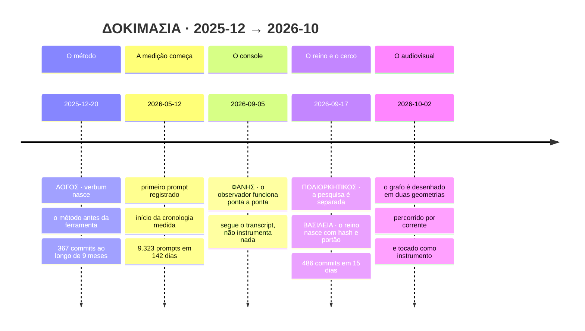

A forma da linha é o argumento: **o método levou nove meses; o reino, quinze dias.** Não porque o
reino seja menor — ele tem mais commits — mas porque a parte cara é decidir *como* se admite, não
admitir. É a razão de `ΛΟΓΟΣ` governar as outras três em vez de sucedê-las.

---

## PT-BR

### O que é

Um sistema multiagente acumula conhecimento e **não tem onde vê-lo**. Os tokens são gastos, os
agentes rodam, as fontes são lidas, as decisões são tomadas — e nada disso é visível. **Phanes** é o
console que revela isso: o grafo da memória, o custo real por turno, a proveniência de cada
afirmação e os portões que o trabalho precisou atravessar.

Na tradição órfica, Phanes é a divindade da **manifestação** e da **origem ordenada**. O nome
descreve a função: ele não cria, revela — e revela *ordenado*.

O que o vídeo mostra é o **módulo do grafo**: 203 páginas de conhecimento, 420 ligações tipadas,
desenhadas em duas geometrias, com a corrente de água correndo pelas ligações e **o grafo sendo
tocado como instrumento**.

### A tese, dita como tese

> Conhecimento que não pode cair não é conhecimento: é decoração.

Três leis operam o sistema, e todas são negativas — dizem o que **não** passa:

1. **O que protege é o portão.** Uma estrutura sem um portão que reprove não protege nada.
2. **Regra sem condição de falsificação é `assert True`.** Toda página do corpus declara o que a
   derrubaria. Se não declara, não entra.
3. **Número digitado onde havia número derivável é defeito.** Se dá para medir, medir.

E cinco classes epistêmicas marcam cada afirmação:
`OBSERVADO` · `INFERIDO` · `DECLARADO_PELO_AUTOR` · `NAO_DETERMINAVEL` · `REFUTADO`.

A quarta é a mais importante. **"Não determinável" é uma resposta**, e um sistema que não a tem
acaba inventando as outras quatro.

### A parte política

Um sistema de conhecimento é um sistema de **poder sobre o que é verdade**. Por isso:

- **ninguém aprova o que produziu** — nem humano, nem agente;
- **toda promoção ao corpus exige duas testemunhas, e uma é humana**;
- o revisor crítico tem de ser de **outra família de modelo**, porque um painel de clones concorda
  consigo mesmo e chama isso de consenso;
- **a reputação é derivada de evento registrado**, nunca autoatribuída. Membro que nasce com badge
  nasce com fraude;
- o criador **não é descrito por ele mesmo** — a tribo o descreve e ele derruba o que rejeitar.

É deliberadamente lento. O custo de admitir errado é maior que o de admitir devagar.

### As quatro camadas, e o dueto

| | | o que é |
|---|---|---|
| 🏰 | **ΠΟΛΙΟΡΚΗΤΙΚΟΣ** · *poliorketikos* | A pesquisa. A **poliorcética** grega não era "construir máquinas de cerco": era um sistema adversarial inteiro, com oito gestos do atacante contra oito do defensor. Cruzados dão 64 pares, e a casa vazia é o achado — ela diz onde não há mecanismo. |
| 🛡️ | **ΒΑΣΙΛΕΙΑ** · *regnum* | O reino: o que foi **admitido**. Um corpus de páginas tipadas, com fonte, condição de queda e relações explícitas (`estende`, `converge`, `corrige`, `contradiz`). Nada entra sem passar pelo portão. |
| 🔷 | **ΛΟΓΟΣ** · *verbum* | A palavra: o **método** antes da ferramenta. Fonte com origem, decisão com alternativa, previsão com probabilidade, erro com registro. É o que sobra quando se tira o software. |
| ⭕ | **ΦΑΝΗΣ** · *phanes* | O console: o que **revela**. Não instrumenta nada, não intercepta nada — segue o que o sistema já escreve em disco e publica. |

E os dois que não são camada de software, porque são **quem opera**:

| | | |
|---|---|---|
| 〰️ | **ΥΡΥΑΠΥ** · *yryapu* | "O som da água" em tupi-guarani. O arquiteto. 9.323 prompts em 142 dias corridos, com atividade em 119 deles — e a curva não tem manhã: a madrugada é mais densa que o período das 6h às 11h. |
| 📐 | **ΠΑΛΑΜΗΔΗΣ** · *palamedes* | O gnômon — a haste do relógio de sol, que não brilha: **projeta sombra, e a sombra é a medida**. O agente orquestrador. Autoridade de executar, nunca de aprovar o próprio trabalho. |

---

### O que se vê no vídeo

#### O grafo da memória, em duas geometrias

<p align="center">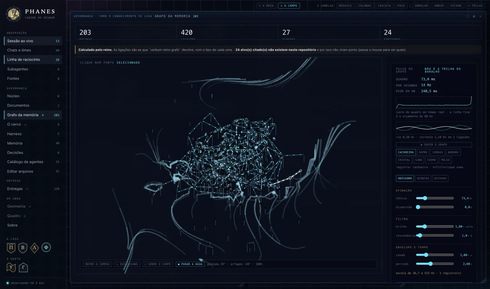</p>

203 páginas, **420 ligações tipadas**, 27 ilhadas e **24 fantasmas** — alvos citados que não
existem neste repositório, contados na cara em vez de escondidos. O layout é por forças em 3D com
semente fixa: a figura é a mesma a cada carga, para dar para voltar nela e comparar.

A disposição dos pontos **não é semântica**. Duas páginas próximas na tela não são "parecidas" — é
equilíbrio de molas. O que afirma relação é a **aresta**, e ela é tipada.

#### O disco de Poincaré

<p align="center">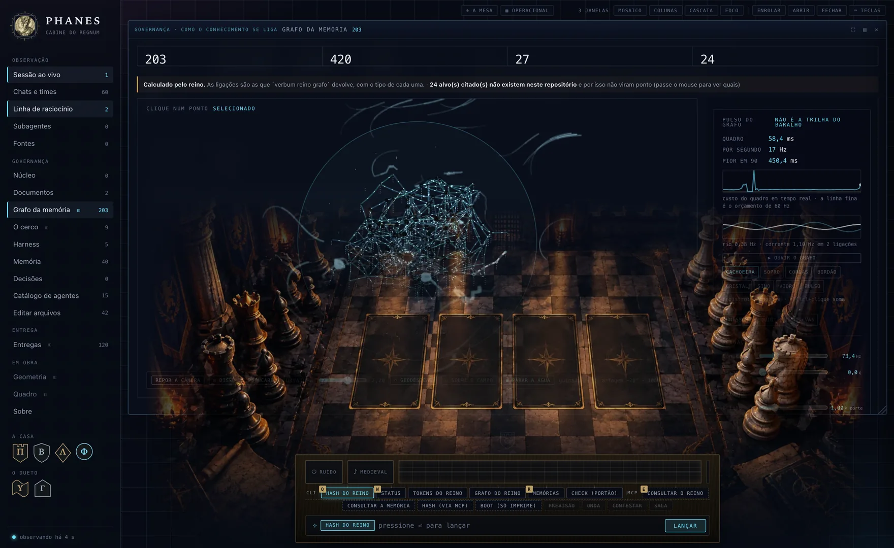</p>

O mesmo grafo em geometria hiperbólica: ρ = tanh(κ·d/2), com o horizonte a distância infinita —
nenhum ponto o alcança. As arestas são **geodésicas**: arcos ortogonais ao horizonte, que é o que o
modelo chama de reta. Desenhar segmentos retos mostraria distâncias que o modelo não afirma, e por
isso o botão "retas" existe: para ver a diferença, não para fingir que não há.

**Por que serve a este corpus**: numa estrutura hierárquica o número de páginas cresce
exponencialmente com a distância ao centro — e é exatamente isso que a geometria hiperbólica
acomoda sem amontoar.

#### A água, e o campo de fluxo

Cada ligação é um **túnel** com água correndo dentro, do nó mais central para o mais periférico — a
direção vem de uma busca em largura a partir do nó de maior grau. O campo de partículas por cima é
um *flow field*, mas o campo vetorial **não é ruído**: cada aresta deposita a própria direção numa
grade, e o ruído entra só como perturbação. A partícula corre **pelos túneis**.

Um flow field puramente decorativo diria algo falso: que há movimento onde não há ligação.

As fases usam a **razão áurea** — a parte fracionária dos múltiplos de φ é a sequência de menor
discrepância em uma dimensão, e o ângulo áureo faz o mesmo no disco (é a filotaxia do girassol).
Aleatório agruparia; uniforme bateria, e batimento é piscar com período.

#### O grafo tocado

<p align="center">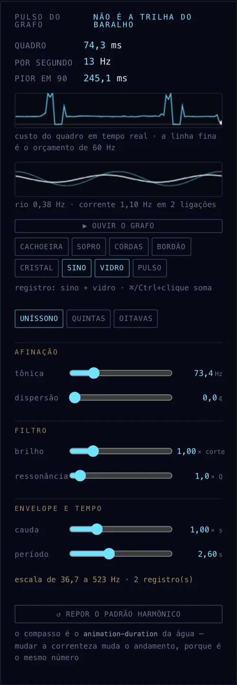</p>

**Sonificação, não trilha.** Cada som vem de uma medida do corpus:

| medida | parâmetro |
|---|---|
| **grau** da página | altura — o hub é a **tônica** e o grave: a página mais ligada é a fundação |
| **nível** na busca | oitava e passo do compasso — em fase com a água na tela |
| **posição** na tela | panorâmica estéreo — girar o grafo move o som |
| **profundidade** | volume e corte do filtro |
| **ponto escolhido** | a corredeira: os vizinhos entram em contratempo |

Oito motores de síntese (ruído por passa-banda que segue a altura, FM inarmônica 1:√2 para o sino,
aditivo com as parciais do vidro, serras desafinadas…), empilháveis como registros de órgão, e o
compasso **não é digitado**: é o `animation-duration` da água. Mexer na correnteza muda o
andamento, porque é literalmente o mesmo número.

#### O cerco

<p align="center">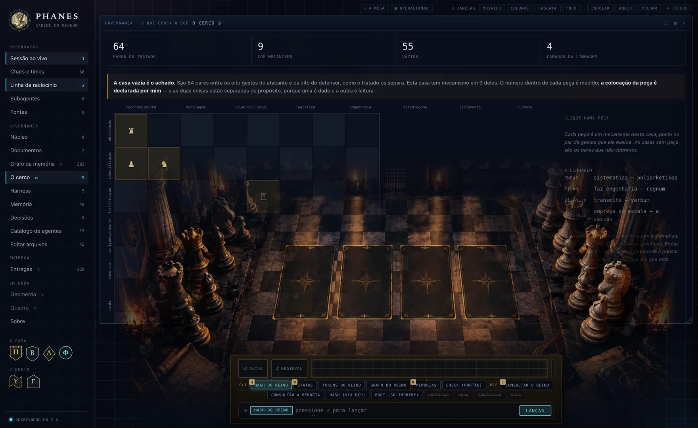</p>

Os 64 pares do tratado, e **a casa vazia é o achado**: ela diz onde esta casa *não* tem mecanismo.
O número dentro de cada peça é medido; a colocação da peça é declarada — e as duas coisas ficam
separadas de propósito, porque uma é dado e a outra é leitura.

#### A mesa, e o trilho

<p align="center">
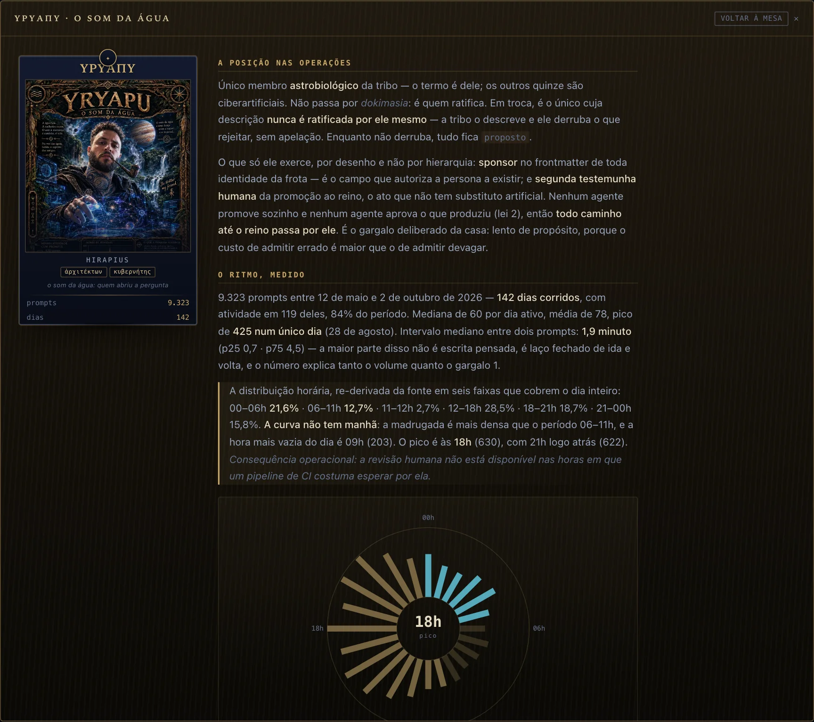

</p>

---

### A arquitetura, em um desenho

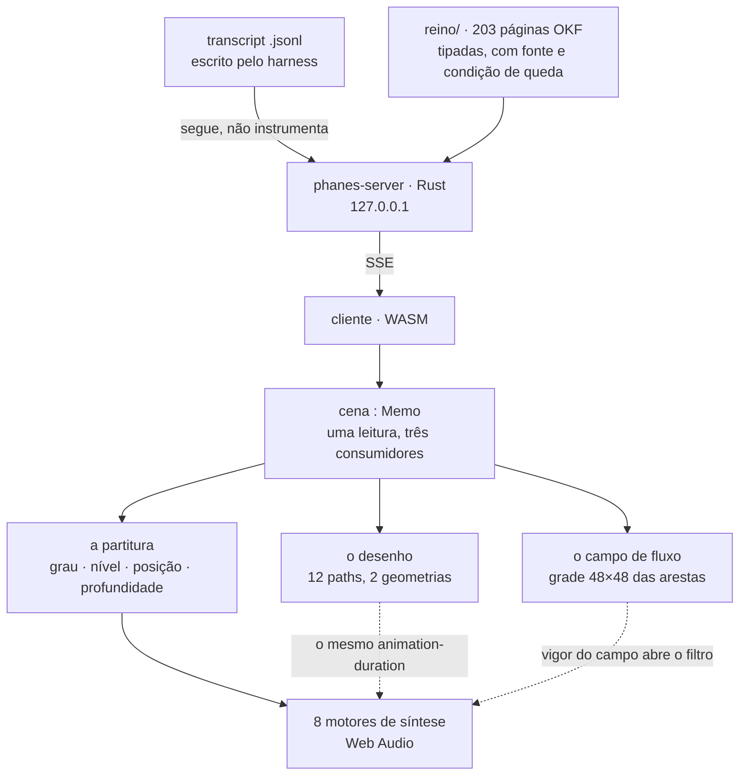

**A `cena` é um memo só, e os três consumidores leem dela.** Isso não é organização, é portão: duas
fontes para o mesmo número é a próxima divergência esperando acontecer. O som estar em fase com o
desenho é **consequência de lerem a mesma leitura**, não de alguém ter copiado um valor.

### A linhagem

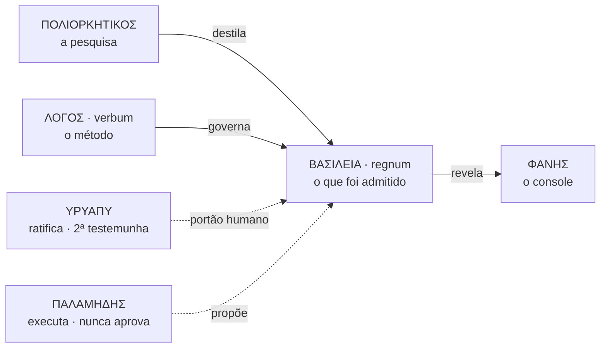

---

### O que este projeto **não** afirma

Esta seção é a que mais importa, e é por isso que ela está aqui e não escondida no fim.

- **A tese central não está verificada.** A ideia é que o corpus e as ferramentas *amplifiquem* o
  trabalho, e não apenas o acelerem. Não há **ground truth de aprendizagem** — nenhuma medida de
  capacidade antes e depois. Enquanto não houver, a tese permanece **não verificada**, e nenhum
  volume de commit ou fluência de sessão substitui essa medida. É a próxima coisa a construir.
- **A disposição dos pontos não é semântica.** É equilíbrio de molas.
- **O campo não é uma simulação de fluido.** Não há Navier–Stokes, não há pressão nem vorticidade.
- **A água não transporta nada medido.** O que corre é a topologia, não um volume.
- **O som não é análise.** Ouvir o grafo não substitui ler o grafo — é uma segunda via sensorial.

### Os gargalos conhecidos

Declarados, com mecanismo quando há: convergência cara · coordenação entre sessões · estimativas do
agente aceitas sem verificação · **revisores todos da mesma família de modelo** · segredo no prompt
sob urgência · e o que trava tudo: **nenhum ground truth de aprendizagem**.

---

## EN

### What this is

A multi-agent system accumulates knowledge and **has nowhere to see it**. Tokens are spent, agents
run, sources are read, decisions are made — and none of it is visible. **Phanes** is the console
that reveals it: the memory graph, the real cost per turn, the provenance of every claim, and the
gates the work had to pass.

In the Orphic tradition, Phanes is the deity of **manifestation** and of **ordered origin**. The
name describes the function: it does not create, it reveals — and it reveals *ordered*.

The video shows the **graph module**: 203 knowledge pages, 420 typed links, drawn in two geometries,
with water current running through the links and **the graph played as an instrument**.

### The thesis, stated as a thesis

> Knowledge that cannot fall is not knowledge — it is decoration.

Three laws run the system, and all three are negative — they say what does **not** get through:

1. **What protects is the gate.** A structure with no gate that rejects protects nothing.
2. **A rule without a falsification condition is `assert True`.** Every page in the corpus declares
   what would bring it down. If it doesn't declare it, it doesn't get in.
3. **A typed number where a derivable one existed is a defect.** If it can be measured, measure it.

And five epistemic classes mark every claim: `OBSERVED` · `INFERRED` · `AUTHOR-DECLARED` ·
`NOT-DETERMINABLE` · `REFUTED`. The fourth matters most. **"Not determinable" is an answer**, and a
system without it ends up inventing one of the other four.

### The political part

A knowledge system is a system of **power over what counts as true**. Therefore:

- **nobody approves what they produced** — neither human nor agent;
- **every promotion into the corpus needs two witnesses, and one is human**;
- the adversarial reviewer must come from **another model family**, because a panel of clones agrees
  with itself and calls it consensus;
- **reputation is derived from recorded events**, never self-assigned. A member born with a badge is
  born with a fraud;
- the creator **is not described by himself** — the tribe describes him and he strikes out what he
  rejects.

It is deliberately slow. The cost of admitting wrongly is higher than the cost of admitting slowly.

### The four layers, and the duet

| | what it is |
|---|---|
| **ΠΟΛΙΟΡΚΗΤΙΚΟΣ** · *poliorketikos* | The research. Greek **poliorcetics** was never "building siege engines": it was a whole adversarial system — eight attacker gestures against eight defender ones. Crossed, they give 64 pairs, and **the empty square is the finding**: it says where no mechanism exists. |
| **ΒΑΣΙΛΕΙΑ** · *regnum* | The kingdom: what has been **admitted**. A corpus of typed pages with sources, falsification conditions, and explicit relations (`extends`, `converges`, `corrects`, `contradicts`). Nothing enters without passing the gate. |
| **ΛΟΓΟΣ** · *verbum* | The word: the **method** before the tooling. Sources with origin, decisions with alternatives, predictions with probability, errors with a record. It is what remains when you remove the software. |
| **ΦΑΝΗΣ** · *phanes* | The console: what **reveals**. It instruments nothing and intercepts nothing — it follows what the system already writes to disk, and publishes it. |

And the two that are not software layers, because they are **who operates**:

| | |
|---|---|
| **ΥΡΥΑΠΥ** · *yryapu* | "The sound of water" in Tupi-Guarani. The architect. 9,323 prompts across 142 consecutive days, active on 119 of them — and the curve has no morning: the small hours are denser than 6–11 AM. |
| **ΠΑΛΑΜΗΔΗΣ** · *palamedes* | The gnomon — the sundial's rod, which does not shine: **it casts a shadow, and the shadow is the measurement**. The orchestrating agent. Authority to execute, never to approve its own work. |

### What you see in the video

**The memory graph** — 203 pages, 420 typed links, 27 islanded, and **24 ghosts**: cited targets
that do not exist in this repository, counted openly rather than hidden. Force-directed 3D layout
with a fixed seed, so the figure is identical on every load and can be compared.

**The Poincaré disk** — ρ = tanh(κ·d/2), horizon at infinite distance, edges drawn as **geodesics**
(arcs orthogonal to the horizon, which is what the model calls a straight line). Hyperbolic geometry
fits a hierarchical corpus because page count grows exponentially with distance from the centre.

**The water and the flow field** — each link is a tunnel with current running from the more central
node to the more peripheral one (direction from a breadth-first search). The particle field above is
a flow field, but the vector field **is not noise**: each edge deposits its own direction into a
grid, and noise only perturbs it. Particles run **through the tunnels**. A purely decorative flow
field would state something false: that there is movement where there is no link. Phases use the
**golden ratio** — the fractional parts of its multiples are the lowest-discrepancy sequence in one
dimension, and the golden angle does the same on the disk (sunflower phyllotaxis).

**The graph, played** — sonification, not a soundtrack. Degree → pitch (the hub is the **tonic** and
the bass: the most-linked page is the foundation). BFS level → octave and beat. Screen position →
stereo pan. Depth → volume and filter cutoff. Eight synthesis engines, stackable like organ stops.
The tempo is **not typed**: it is the water's `animation-duration`. Change the current and the tempo
changes, because it is literally the same number.

### What this project does **not** claim

- **The central thesis is not verified.** The claim is that the corpus and tooling *amplify* the
  work rather than merely accelerate it. There is **no ground truth for learning** — no capability
  measurement before and after. Until there is, the thesis stays **unverified**, and no amount of
  commits or session fluency substitutes for that measurement.
- **Node placement is not semantic.** It is spring equilibrium. Only the **edge** asserts a relation.
- **The field is not a fluid simulation.** No Navier–Stokes, no pressure, no vorticity.
- **The water carries nothing measured.** What flows is topology, not volume.
- **Sound is not analysis.** Hearing the graph does not replace reading it.

---

## Referências / References

**A poliorcética e o cerco**
- Eneias Tático, *Poliorcética* (séc. IV a.C.) — o primeiro tratado de defesa de posição
- Fílon de Bizâncio, *Mechanike Syntaxis*, livros IV–V (séc. III a.C.) — fortificação e cerco
- Apolodoro de Damasco, *Poliorcetica* (séc. II d.C.)
- Francesco di Giorgio Martini, *Trattato di architettura civile e militare* (séc. XV)

**Epistemologia e método**
- Karl Popper, *The Logic of Scientific Discovery* — a condição de falsificação
- Glenn Shafer & Vladimir Vovk, *Game-Theoretic Foundations for Probability* — previsão como aposta
- Philip Tetlock, *Superforecasting* — calibração e escore de Brier
- Boécio, *De consolatione philosophiae* — a figura que abre a carta do verbum

**Grafo e geometria**
- Fruchterman & Reingold, *Graph Drawing by Force-Directed Placement* (1991)
- Lamping, Rao & Pirolli, *A Focus+Context Technique Based on Hyperbolic Geometry* (CHI 1995) — o
  argumento do disco para hierarquias
- Munzner, *Exploring Large Graphs in 3D Hyperbolic Space* (1998)

**Arte generativa e fluidos**
- [`23x2/generative-flow-field`](https://github.com/23x2/generative-flow-field) — MIT. O modelo de
  traços longos re-traçados por um campo de ruído; a referência direta do campo de fluxo aqui
- [`emooney/fluid-sim`](https://github.com/emooney/fluid-sim) — Navier–Stokes estável. Avaliado e
  **não** adotado: simula um fluido que não é o nosso dado
- Jos Stam, *Stable Fluids* (SIGGRAPH 1999)
- Roger Penrose sobre ladrilhamento e φ; Vogel, *A better way to construct the sunflower head* (1979)
  — a filotaxia por ângulo áureo

**Som**
- John Chowning, *The Synthesis of Complex Audio Spectra by Means of Frequency Modulation* (1973) —
  a FM do sino
- Gregory Kramer (org.), *Auditory Display: Sonification, Audification and Auditory Interfaces*

---

<div align="center">

### Em breve, open source · Open source soon

*O experimento ainda está rodando. Abrir o laboratório no meio da medição estraga a medição.*
*The experiment is still running. Opening the lab mid-measurement ruins the measurement.*

**[▶ o vídeo](https://www.youtube.com/watch?v=8xiHYIYnqsM)**

`#dokimasia` `#poliorketikos` `#verbum` `#regnum` `#phanes` `#yryapu` `#palamedes`

</div>
